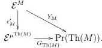

of $S$ is partial left adjoint of the map $Y_M$. Consider the commutative diagram (which is part of the diagram (5)):

As noted in Proposition 5.2 $G_{\mathrm{Th}(M)}$ is a fully faithful right adjoint. We write $(G_{\mathrm{Th}(M)})^L$ for its left adjoint. By the functoriality of taking partial left adjoints established in Section 4 we have that $\mathrm{Th}(\epsilon_M) \circ (G_{\mathrm{Th}(M)})^L|_{im(y_{\mathrm{Th}(M)})} \simeq \Psi$ (note that $\mathrm{Th}(\epsilon_M)$ is a partial left adjoint to $\epsilon_M'$ by construction). Let $\psi'\psi$ be the factorization of $y_{\mathrm{Th}(M)}$ through its essential image. Since $y_{\mathrm{Th}(M)}$ is fully faithful, $\psi$ is an equivalence. We have that $\eta_{\mathrm{Th}(M)} = (G_{\mathrm{Th}(M)})^L|_{im(y_{\mathrm{Th}(M)})} \circ \psi$. Thus, $\Psi \circ \psi = \mathrm{Th}(\epsilon_M) \circ \eta_{\mathrm{Th}(M)}$ is an equivalence.

We want to show now that $\eta_{\mathrm{Th}(M)}$ is an equivalence. It is essentially surjective by construction. We want to show that it induces a bijection on homotopy groups of mapping spaces. It induces a monomorphism of homotopy groups of mapping spaces since it has a left inverse.

As noted in Proposition 5.2 $G_{\mathrm{Th}(M)}$ is fully faithful, so we have $G_{\mathrm{Th}(M)}^L \circ G_{\mathrm{Th}(M)} \simeq id$. $G_{\mathrm{Th}(M)}^L$ induces a surjection on homotopy groups for each mapping spaces between objects in the image of $G_{\mathrm{Th}(M)}$. The essential image of the restricted Yoneda embedding in (5) contains the essential image of $y_{\mathrm{Th}(M)}$, so the image of $G_{\mathrm{Th}(M)}$ contains $im(y_{\mathrm{Th}(M)})$ by the commutativity of (5). Thus $G_{\mathrm{Th}(M)}^L|_{im(y_M)}$ induces surjections on homotopy groups of mapping spaces. $\eta_{\mathrm{Th}(M)} = G_{\mathrm{Th}(M)}^L|_{im(y_M)} \circ y_{\mathrm{Th}(M)}$. Thus, we conclude that $\eta_{\mathrm{Th}(M)}$ induces bijections on homotopy groups of mapping spaces as well.

**Theorem 5.9.** $\mu^{(-)} : \mathbf{PreTh}_A \rightleftarrows \mathbf{Mnd}_E : \mathbf{Th}$ is an idempotent adjunction, with unit $\eta$.

*Proof.* By Lemma 5.8 and Lemma 2.2, it remains to verify that $\epsilon, \eta$ satisfy the second of the triangle identities, i.e. that for all $A$-pretheory $\mathcal{K}$, the morphism of monads $\epsilon_{\mu^\mathcal{K}} \circ \mu^{\eta^\mathcal{K}}$ is an equivalence. As these are morphisms of monads, we will work through the equivalence of Theorem 3.22 and instead show the induced functor between $\infty$-categories of algebras is an equivalence.

35