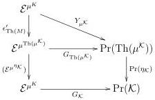
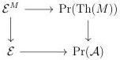

We have a commutative diagram, functorial in $\mathcal{K}$

where $Y_{\mu^{\mathcal{K}}}$ is the restricted Yoneda embedding. We want to show that the composite of two left vertical functors is an equivalence. The composite of the functor $\operatorname{Pr}(\eta_{\mathcal{K}}) \circ Y_{\mu^{\mathcal{K}}}$ is given by

$$x \mapsto (y \mapsto \operatorname{Map}_{\operatorname{Pr}(\mathcal{K})}(G_{\mathcal{K}}^{L} \circ y_{\mathcal{K}}(y), x)),$$

where $y_{\mathcal{K}}$ is the Yoneda embedding. This is naturally equivalent to the functor

$$\mathcal{E}^{\mu^{\mathcal{K}}} \to \operatorname{Pr}(\mathcal{K}), x \mapsto (y \mapsto \operatorname{Map}_{\operatorname{Pr}(\mathcal{K})}(y_{\mathcal{K}}(y), G_{\mathcal{K}}(x)))$$

which is equivalent to $G_{\mathcal{K}}$, by the $\infty$-categorical Yoneda Lemma (see [15, Proposition 5.5.2.1], or rather [6, Theorem 5.8.13.(ii)] as we need the equivalence to be functorial).

Thus, we have that $G_{\mathcal{K}} \circ (\mathcal{E}^{\eta_{\mathcal{K}}})^{op} \circ \epsilon_{\operatorname{Th}(M)}^{op} \simeq G_{\mathcal{K}}$. Since $G_{\mathcal{K}}$ is fully faithful, and thus an equivalence onto its essential image, we conclude that $(\mathcal{E}^{\eta_{\mathcal{K}}})^{op} \circ \epsilon_{\operatorname{Th}(M)}^{op}$ is an equivalence by 2 out of 3.

Remark 5.10. Note that there is nothing asymmetric between $\eta$ and $\epsilon$ and we have also proved that $\epsilon$ is a counit of adjunction. We just have not showed any coherence conditions between this counit $\epsilon$ and the unit $\eta$.

Definition 5.11. A monad $M$ on $\mathcal{E}$ is said to be $\mathcal{A}$-nervous if $\epsilon_{M}$ is an equivalence, i.e. if the square

36