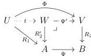
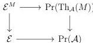

- $\Psi$ is fully faithful,
- $R_1, R_2$ are monadic right adjoint functors, with left adjoint $L_1$ and $L_2$,
- the natural transformation $L_2\Psi \to \Phi L_1$ obtains from these adjunction is invertible.

Then the square is a pullback of $\infty$-categories.

Proof. We form the pullback:

We will show that $t$ is an equivalence using Lemma 3.25. That is we will show that $R'_2$ is a monadic right adjoint functor and that the natural transformation $L'_2 \to tL_1$ is an equivalence of categories.

$\Psi$, and hence its pullback $\Psi'$ are both fully faithful, so up to equivalences of categories, one can freely assume that $W$ and $A$ are full subcategories of $V$ and $B$. In this case, $R'_2$ is just the restriction of $R_2$ to a functor $W \to A$. The isomorphisms $L_2\Psi \simeq \Phi L_1$ show that if $X \in A$ then $L_2X \in W$, which immediately implies that $L_2$ corestricted to a functor $A \to W$ is a left adjoint to $R'_2$. Hence, by Proposition 3.23, $R'_2$ is indeed a monadic functor. Now, again as we are simply restricting to full subcategories, the natural transformation $L'_2 \to tL_1$ is exactly the same as $L_2\Psi \to \Phi L_1$ and hence is invertible.

**Theorem 6.4.** Given $\mathcal{E}$ a presentable $\infty$-category and $\mathcal{A} \subset \mathcal{E}$ a full dense small subcategory, then any monad $M$ with arities in $\mathcal{A}$ is $\mathcal{A}$-nervous.

Proof. For any monad $M \in \mathbf{Mnd}_{\mathcal{E}}$ we have a commutative square of $\infty$-categories:

39