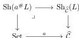

10

SIMON HENRY AND CHRISTOPHER TOWNSEND

frame in $\widehat{\mathcal{C}}$. However, this description works differently from ours, and would not recover our result, but we can explain how they relate.

Each object of $a \in \mathcal{C}$ induces a geometric morphisms $a : \text{Set} \rightarrow \widehat{\mathcal{C}}$ defined by $a^*F = F(a)$. Now given a frame (or locale) $L$ in $\widehat{\mathcal{C}}$ there are two different ways to use this point to get a frame in Set: In general the image of frame by an inverse image functor will not be a frame, but in this specific case we do obtain a frame $a^*L = L(a)$. There is however a way to “pullback” a frame along a geometric morphism, by taking a site of definition for the frame and pullback the site using $a^*$, the resulting construction on frames is sometime denoted $a^\#L$, it also corresponds to the pullback of toposes

Now, in general these $a^\#L$ are not functorial in the point $a$ (at least not for the usual notion of morphisms of frame or locale). However, in the special case where $L$ is a compact Hausdorff frame it is possible to show that $a^\#L = C(a^*L)$, which proves that they are covariant in $a \in \mathcal{C}$ when seen as values in frame.

Now, the key point is that the Joyal-Tierney description of frames in $\widehat{\mathcal{C}}$ is in terms of the functor $L(a) = a^*L$, while ours is in terms of the functors $L_a = a^\#L = C(a^*L)$. In particular, they are connected by the formulas:

$$L_a = C(L(a)) \quad L(a) = \widetilde{L_a}$$

Here the second identity, follows from the observation above that for $L$ an internal compact regular frame seen as an object in $\mathbf{NDL}_{\widehat{\mathcal{C}}} = [\mathcal{C}^{op}, \mathbf{NDL}]$ satisfies $L = C_{\widehat{\mathcal{C}}}L = \widetilde{C \circ L}$, so as $L_a = C(L(a))$ one obtains that $L(a) = \widetilde{C(L(a))} = \widetilde{L_a}$. The “$L(a)$” construction also corresponds with the identification of $\mathbf{KRegFrm}_{\widehat{\mathcal{C}}}$ as a non-full subcategory of $[\mathcal{C}, \mathbf{NDL}]$ that we used during the proof.

We do not expect that such a description in terms of the $L_a$ as we provided here for compact regular frame can be extended to general frame.

#### REFERENCES

- [BF06] Bunge, M. and Funk, J. *Singular coverings of toposes*, Springer, 2006.
- [J82] Johnstone, P.T. *Stone Spaces*, Cambridge Studies in Advanced Mathematics 3, Cambridge University Press 1982. xxi+370 pp.
- [J02] Johnstone, P.T. *Sketches of an elephant: A topos theory compendium*. Vols 1, 2, Oxford Logic Guides **43**, **44**, Oxford Science Publications, 2002.
- [JT84] Joyal, A. and Tierney, M. *An extension of the Galois theory of Grothendieck*. Vols 309, American Mathematical Soc, 1984.
- [SVW14] Spitters, B., Vickers, S. and Wolters, S. *Gelfand Spectra in Grothendieck Toposes using Geometric Mathematics*. in R Duncan and P Panangaden (eds), Proceedings 9th Workshop on Quantum Physics and Logic (QPL2012). vol. 158, EPTCS, vol. 158, Open Publishing Association, pp. 77-107. (2014)
- [T06] C.F. Townsend, C.F. *On the parallel between the suplattice and preframe approaches to locale theory* Annals of Pure and Applied Logic, Volume **137**, Issues 1–3, 2006, Pages 391-412.

Email address: Shenry2@uottawa.ca

Email address: info@christophertownsend.org