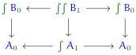
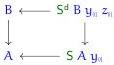

particular for every $x : A_0$ we have $Z^d(S A x) : A_0 \to \text{Type}$, hence for every additional $y : A_0$ we have a type $Z^d(S A x) y$. We call this the type $A_1 x y$ of 1-simplices from $x$ to $y$.

2. Now we know that every semi-simplicial type $A$ has not only an underlying type of 0-simplices $A_0$, but for every $x_0, x_1 : A_0$ a type $A_1 x_0 x_1$ of 1-simplices. Therefore, it stands to reason that any semi-simplicial type $B$ over $A$ should also have, not only a type family $B_0$ over $A_0$, but a type family $B_1$ over $A_1$. Thinking of $A_1$ as an indexed representation of a span $A_0 \leftarrow \int A_1 \to A_0$, we deduce that $B_1$ should be an indexed representation of a span morphism

and therefore we should have

$$B_1 : (y_0 : A_0) (z_0 : B_0 y_0) (y_0 : A_0) (z_0 : B_0 y_0) (\gamma_0 : A_1 y_0 y_0) \to \text{Type}.$$

More precisely, since every 0-simplex $y_0$ of $A$ gives rise to a semi-simplicial type $S A y_0$ over $A$, any 0-simplex $z_0$ of $B$ over $y_0$ should give rise to a semi-simplicial type $S^d B y_0 z_0$ over both $B$ and $S A y_0$. But the common dependence on $A$ should be shared, so $S^d B y_0 z_0$ should live over the cospan $B \to A \leftarrow S A y_0$:

Passing to 0-simplices, this means that $Z^{dd}(S^d B y_0 z_0)$ should be a type dependent on $y_0 : A_0, z_0 : B_0 y_0$, and $y_{11} : (S A y_0)_0 y_0 \equiv A_1 y_0 y_0$. Thus we can define the 1-simplices of $B$ as $B_1 y_0 z_0 y_0 z_0 \gamma_0 \equiv Z^{dd}(S^d B y_0 z_0) y_0 z_0 \gamma_0$.

In particular, therefore, since for any $x : A_0$ we have a semi-simplicial type $S A x$ over $A$, we have

$$(S A x)_1 : (y_0 : A_0) (z_0 : (S A x)_0 y_0) (y_0 : A_0) (z_0 : (S A x)_0 y_0) (\gamma_0 : A_1 y_0 y_0) \to \text{Type}.$$

Since $(S A x)_0 y_0 \equiv A_1 x y_0$ by definition, this is equivalently

$$(S A x)_1 : (y_0 : A_0) (z_0 : A_1 x y_0) (y_0 : A_0) (z_0 : A_1 x y_0) (\gamma_0 : A_1 y_0 y_0) \to \text{Type}.$$

Renaming the variables as $y_0 \equiv x_{00}$, $\gamma_0 \equiv \beta_{00}$, and $z_0 \equiv \beta_{01}$, and writing $x \equiv x_{01}$, this becomes

$$(S A x_{01})_1 : (x_{01} : A_0) (\beta_{01} : A_1 x_{01} x_{01}) (x_{00} : A_0) (\beta_{01} : A_1 x_{00} x_{00}) (\beta_{00} : A_1 x_{00} x_{00}) \to \text{Type}.$$

Thus, this is precisely correct to be a type of 2-simplices:

$$A_2 x_{01} x_{00} \beta_{01} x_{00} \beta_{01} \beta_{10} \equiv (S A x_{01})_1 x_{00} \beta_{01} x_{00} \beta_{01} \beta_{10}.$$

5