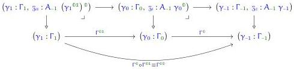

Note that $\Gamma_0$ (for example) denotes the 0-component of the presheaf $\Gamma$, which is an object at dm, while $\gamma_0$ is an atomic variable name belonging to this object. As another example, the type annotation on the variable $x_0$ is well-typed because the outer square of the following diagram is a distinguished pullback:

We will write the type declarations of $A_n$ generically as:

$$\gamma_{n+1} : \Gamma_{n+1}, \ \partial a : \pi A_{\partial(n+1)} \ \gamma_{n+1} \vdash_{dm} A_{n+1} \ \gamma_{n+1} \ \partial a \text{ type}_{\ell_{n+1}}.$$

Here $\pi A_{\partial(n+1)}$ is a telescope consisting of the 'boundary' of an $(n+1)$-simplex, also known as the Reedy 'matching object' of an augmented semi-simplicial type. For example, we will have:

$$\begin{array}{l} A_{\partial(-1)} \ \gamma_{-1} \equiv () \\ A_{\partial 0} \ \gamma_0 \equiv (\mathfrak{z}_0 : A_{-1} \ \gamma_0^0) \\ A_{\partial 1} \ \gamma_1 \equiv (\mathfrak{z}_0 : A_{-1} \ \gamma_1^{00}, x_0 : A_0 \ \gamma_1^{01} \mathfrak{z}_0, x_0 : A_0 \ \gamma_1^{10} \mathfrak{z}_0). \end{array}$$

Similarly, we would like to define simplicial terms to consist of the data of their discrete m-simplex terms for $m \leqslant n + 1$. The judgement

$$\gamma : \Gamma \vdash_{sm^{n+1}} t \ \gamma : A \ \gamma$$

will be defined to consist of the data:

$$\begin{array}{l} \gamma_{-1} : \Gamma_{-1} \vdash_{dm} t_{-1} \ \gamma_{-1} : A_{-1} \ \gamma_{-1} \\ \gamma_0 : \Gamma_0 \vdash_{dm} t_0 \ \gamma_0 : A_0 \ \gamma_0 \ (t_{-1} \ \gamma_0^0) \\ \gamma_1 : \Gamma_1 \vdash_{dm} t_1 \ \gamma_1 : A_1 \ \gamma_1 \ (t_{-1} \ \gamma_0^{00}) \ (t_0 \ \gamma_1^{01}) \ (t_0 \ \gamma_1^{10}) \\ \vdots \end{array}$$

Similarly to before, we will write this generically as

$$\gamma_{n+1} : \Gamma_{n+1} \vdash_{dm} t_{n+1} \ \gamma_{n+1} : A_{n+1} \ \gamma_{n+1} \ (\pi t_{\partial(n+1)} \ \gamma_{n+1})$$

where $\pi t_{\partial(n+1)} \ \gamma_{n+1}$ denotes the action of the lower-dimensional parts of t on the boundary of $\gamma_{n+1}$.

### 4.2.4 Fibrant Structure

As suggested above, the basic structure of the fibrant theory of the models $sm^n$ will be defined by mutual induction. In this section our goal is to define the presheaves of types and terms in $sm^n$, along with the context extension operation (but not yet its universal property). This requires defining several other notions mutually, including a type-theoretic version of Reedy 'matching objects' and a truncated version of display that decreases dimension.

53