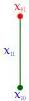
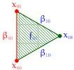

This pattern may be visualised as follows:

Z A

$$Z^d (S A x_{01}) x_{01}$$

$$Z^{dd} (S^d (S A x_{01}) x_{01} \beta_{01}) x_{00} \beta_{01} \beta_{10}$$

An alternative, and more geometrical, viewpoint, is that the n-simplex is the cone of the (n-1)-simplex. Thus, if we already know that every semi-simplicial type has a suitably indexed type of (n-1)-simplices, we can conclude the same about the n-simplices as follows. For every 0-simplex x, the dependent semi-simplicial type S A x has a type of 'dependent (n-1)-simplices' indexed by the type of (n-1)-simplices of A. Thus, an element of this type depends on x (the cone vertex) as well as an (n-1)-simplex of A (the base face, opposite the cone vertex), and its boundary consisting of dependent k-simplices for k < n-1 that form cones over all the faces of the base (n-1)-simplex sharing the same vertex x. Together, these form the boundary of an n-simplex. (In the ordering of variables induced by the above presentation, the simplices in the base face are interspersed with their dependent versions: thus in the case n ≡ 2 the faces x₁₀, x₁₁, β₁₀ form the base 1-simplex with β₁₁, β₁₂ the dependent 0-simplices (i.e. 1-simplices) forming a cone over the boundary x₁₁, x₁₂.) Hopefully this is sufficiently convincing for now; later we will give a precise justification.

As simple and appealing as this 'definition' is, it is not meaningful in ordinary dependent type theory. The intuitive claim is that it defines a type SST by coinduction, with Z and S as destructors. For Z this is unproblematic (it is not even corecursive). However, the output of S is not an element of the type SST being defined, as would be usual for a corecursive destructor of a coinductive type, but a 'dependent element', or 'displayed element', of SST over the input of S. If we write SSTᵈ for this putative family of 'displayed elements', the types of Z and S are

$$Z : SST \rightarrow Type$$

$$S : (X : SST) \rightarrow Z X \rightarrow SST^d X.$$

(1.3)

We would like to regard this as a sort of 'higher coinductive type'. Just as a higher inductive type can have constructors involving not just elements of the type being defined but also paths therein, here we have a putative coinductive type whose destructors involve not just elements of the type being defined but also 'displayed elements' thereof. Thus, to make sense of this we need a type theory with a primitive operation (-)ᵈ associating to a type its family of 'displayed elements'. As it turns out, the precise notion of (-)ᵈ that we require is a variant of unary internal parametricity.

External and internal parametricity. In general, by 'parametricity' we mean a statement that every type (perhaps subject to contextual restrictions; see below) is equipped with a relation (of some arity), and every function (subject to the same restrictions) preserves those relations. The original form of parametricity, such as in [Wad89], is a meta-theoretic

6