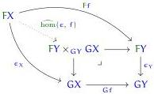

Note that a coalgebra for a copointed endofunctor is not just a coalgebra for its underlying ordinary endofunctor, but satisfies the equation $\epsilon_X \circ x = 1_X$.

As usual, we can obtain terminal coalgebras by a sequential limit construction, when such limits exist. However, in the copointed case it does not suffice to simply consider the limit of the tower $\cdots \to F^1\mathbb{1} \to F^2\mathbb{1} \to F\mathbb{1} \to \mathbb{1}$; we have to incorporate the transformation $\epsilon$ in some way. The classical way to do this (e.g. the dual of [Kel80]) is to take equalisers at each step. However, equalisers are difficult to understand homotopy-theoretically, so we replace them by a pullback. The following definition is a partial dual of [Shu19, Definition 8.6].

Definition 4.43. Given a natural transformation $\epsilon : F \to G$ and a morphism $f : X \to Y$ in the domain of $F$ and $G$, we write $\widehat{\hom}(\epsilon, f)$ for the gap map in the following pullback, assuming that the pullback exists.

If the domain and codomain of $F$ and $G$ have a notion of 'fibration', we say that $\epsilon$ is a Quillen pre-fibration if whenever $f$ is a fibration, so is $\widehat{\hom}(\epsilon, f)$.

For example, we have:

Lemma 4.44. In a category of telescopes, consider the fibrations to be the morphisms isomorphic to a dependent projection of some telescope. Then the transformation evens : $(-)^D \to (-)[\mathcal{Q}^{\Delta\square\leqslant 1_{\text{sim}}}]$ from definition 4.34 is a Quillen pre-fibration.

Proof. Given a dependent projection $(\Theta \mid \Upsilon) \to \Theta$ in $\text{Tel} / (\Gamma \widehat{\mathbf{Q}}_{\Delta\square})$, the gap map is isomorphic to the dependent projection of $\Upsilon^d$:

$$(\Theta^D \mid \Upsilon[\mathcal{Q}^{\Delta\square\leqslant 1}] \mid \Upsilon^d) \to (\Theta^D \mid \Upsilon[\mathcal{Q}^{\Delta\square\leqslant 1}]).$$

Theorem 4.45. Suppose $\mathcal{C}$ is a category with a terminal object and a notion of fibration that is stable under pullback, and that $F$ is a copointed endofunctor of $\mathcal{C}$ such that $\epsilon : F \to 1_{\mathcal{C}}$ is a Quillen pre-fibration. Suppose also that $\mathcal{C}$ has limits of inverse $\omega$-sequences of fibrations, and that $F$ preserves these limits. Then there is a terminal $F$-coalgebra.

Proof. We define inductively a sequence of objects $X_n$ with morphisms $g_{n+1} : X_{n+1} \to X_n$, of which the terminal $F$-coalgebra will be the limit $X_\infty$. We can think of each $X_n$ as an approximation to the terminal coalgebra, with $X_{n+1}$ extending $X_n$ with additional data making it a better approximation; thus each $g_n$ should be a fibration. Since $X_{n+1}$ will be constructed inductively from $X_n$, we can expect it to contain all the data that $X_\infty$ should contain that relates to $X_n$, and thus we can expect to have a map $x_{n+1} : X_{n+1} \to FX_n$ (but not yet to $FX_{n+1}$). To achieve the copointedness condition in the limit for these data, we

81