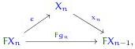
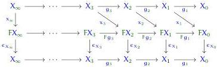

should demand $\epsilon_{X_n} \circ x_{n+1} = g_{n+1}$. And to ensure that the successive approximations are consistent with each other, we should ask that $Fg_n \circ x_{n+1} = x_n \circ g_{n+1}$.

In sum, therefore, we will inductively construct a sequence of objects $X_n$, with fibrations $g_{n+1}: X_{n+1} \to X_n$ and morphisms $x_{n+1}: X_{n+1} \to FX_n$, such that $\epsilon_{X_n} \circ x_{n+1} = g_{n+1}$ and $Fg_n \circ x_{n+1} = x_n \circ g_{n+1}$.

To start with, let $X_0 = \mathbb{1}$, the terminal object, and let $X_1 = FX_0 = F\mathbb{1}$, with $x_1$ the identity. Now, assume the data constructed up to level $n > 0$. The idea is to define $X_{n+1}$ to be the *universal* object equipped with $g_{n+1}$ and $x_{n+1}$ satisfying the desired equations. This means it is a limit of some diagram. The usual way to write that diagram is as the equalizer of the two maps

but this does not make it evident that $g_{n+1}$ is a fibration. Instead, we can express this same limit as the following pullback:

$$
\begin{array}{c}
X_{n+1} \xrightarrow{x_{n+1}} FX_n \\
g_{n+1} \downarrow \quad \downarrow \quad \downarrow \\
X_n \xrightarrow{(1,x_n)} X_n \times_{X_{n-1}} FX_{n-1}.
\end{array}
\tag{4.46}
$$

The commutativity of this square says that $Fg_n \circ x_{n+1} = x_n \circ g_{n+1}$ and $\epsilon_{X_n} \circ x_{n+1} = g_{n+1}$. And by assumption, $\widehat{\hom}(\epsilon, g_n)$ is a fibration, hence so is its pullback $g_{n+1}$.

Now let $X_\infty$ be the limit of the $\omega$-sequence of fibrations

$$
X_\infty \cdots \xrightarrow{g_{n+1}} X_n \xrightarrow{g_n} \cdots \xrightarrow{g_2} X_1 \xrightarrow{g_1} X_0 = \mathbb{1}.
$$

Since $F$ preserves limits of inverse $\omega$-sequences, $FX_\infty$ is the limit of the corresponding sequence

$$
FX_\infty \cdots \xrightarrow{Fg_{n+1}} FX_n \xrightarrow{Fg_n} \cdots \xrightarrow{Fg_2} FX_1 \xrightarrow{Fg_1} FX_0 = \mathbb{1}.
$$

The morphisms $x_n$ and $\epsilon_{X_n}$ form fence diagrams:

composed of the parallelograms $Fg_n \circ x_{n+1} = x_n \circ g_{n+1}$ from our construction, and naturality squares $\epsilon_{X_n} \circ Fg_{n+1} = g_{n+1} \circ \epsilon_{X_{n+1}}$. The former induces a map of limits $x_\infty: X_\infty \to FX_\infty$, while by naturality the latter induces $\epsilon_{X_\infty}$. The universal property of limits implies that

82