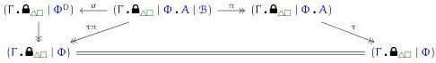
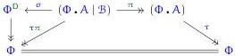

In the presence of levels, the objects of $\mathsf{Tel} \mathbin{//} (\Gamma \cdot \widehat{\mathbf{B}}_{\triangle \square} \mid \Phi)$ are telescopes at any level.

Suppose given the input data for a displayed coinductive type, consisting of

$$\Gamma \in \mathcal {C} \quad \Phi \in \operatorname {T e l} _ {\ell_ {0}} (\Gamma . \widehat {\mathbf {B}} _ {\triangle \square}) \quad A \in \operatorname {T y} _ {\ell_ {1}} (\Gamma . \widehat {\mathbf {B}} _ {\triangle \square} | \Phi) \quad \mathcal {B} \in \operatorname {T e l} _ {\ell_ {2}} (\Gamma . \widehat {\mathbf {B}} _ {\triangle \square} | \Phi . A)$$

$$\sigma \in \mathsf {P S u b} _ {\ell_ {0}} \left(\left(\Gamma . \widehat {\mathbf {B}} _ {\triangle \square} \mid \Phi . A \mid \mathcal {B}\right), \Phi^ {d}\right).$$

Categorically, this yields the data of a sort of 'display polynomial', where we indicate fibrations with $\rightarrow$:

The left vertical map is a fibration because it is isomorphic to the dependent projection

$$(\Gamma . \widehat {\mathbf {B}} _ {\triangle \square} | \Phi | \Phi^ {d}) \rightarrow (\Gamma . \widehat {\mathbf {B}} _ {\triangle \square} | \Phi).$$

Since everything is in the category of telescopes over $\Gamma \cdot \widehat{\mathbf{B}}_{\triangle \square}$, we will omit it from the notation for conciseness, so that the above display polynomial becomes

This display polynomial then defines a copointed endofunctor of $\mathsf{Tel} \mathbin{//} (\Gamma . \widehat{\mathbf{B}}_{\triangle \square} \mid \Phi)$ as follows:

$$\frac {\Gamma , \widehat {\mathbf {B}} _ {\triangle \square} \vdash_ {\mathrm {s m}} X \operatorname {t e l} _ {\ell / \phi : \Phi}}{\Gamma , \widehat {\mathbf {B}} _ {\triangle \square} \vdash_ {\mathrm {s m}} F X \operatorname {t e l} _ {\ell \sqcup \ell_ {1} \sqcup \ell_ {2} / \phi : \Phi , x : X \phi}}$$

$$\mathsf {F X} \equiv \left(\left(a: A \phi , x ^ {\prime}: (b: \mathcal {B} \phi a) \rightarrow X ^ {d} (\phi , \sigma a b) x\right)\right) _ {\phi : \Phi , x: X \phi}$$

Here the $\rightarrow$ denotes a $\Pi$-telescope (section 2.5.3), and $X^d$ denotes meta-abstracted telescope display (section 2.6.4); this is why we wanted those in the syntax. Note that FX is meta-abstracted over $\Phi$ extended by $X$, so it lies in $\mathsf{Tel} \mathbin{//} (\Gamma . \widehat{\mathbf{B}}_{\triangle \square} \mid \Phi \mid X)$ rather than $\mathsf{Tel} \mathbin{//} (\Gamma . \widehat{\mathbf{B}}_{\triangle \square} \mid \Phi)$. The actual endofunctor of $\mathsf{Tel} \mathbin{//} (\Gamma . \widehat{\mathbf{B}}_{\triangle \square} \mid \Phi)$ is thus

$$\overline {{\mathsf {F}}} (X) \equiv (X \mid \mathsf {F X}).$$

The weakening projection $(X \mid \mathsf{FX}) \to X$ is then a copointing $\epsilon : \overline{\mathsf{F}} \to 1$ of this endofunctor, which is evidently a fibration. More than this, we have:

Lemma 4.47. The copointing $\epsilon : \overline{\mathsf{F}} \to 1$ is a Quillen pre-fibration.

Proof. Suppose given a fibration over $X \in \mathsf{Tel}_{\ell_0}(\Gamma, \widehat{\mathbf{B}}_{\triangle \square})$, meaning a dependent telescope

$$\Gamma , \widehat {\mathbf {B}} _ {\triangle \square} \vdash_ {\mathrm {s m}} Y \operatorname {t e l} _ {\ell_ {1}} / _ {\phi : \Phi , x: X \phi}.$$

84