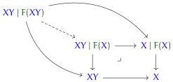

Then we have

$$\Gamma, \mathbf{\Theta}_{\triangle\square} \vdash_{sm} \left( \left( x : X \phi \mid y : Y \phi x \right) \right)_{\phi : \Phi} \text{tel}_{\ell_0 \sqcup \ell_1} / \phi : \Phi$$

which we write as XY for conciseness. Then by definition, we have

$$F(XY) \equiv \left( \left( a : A \phi, z' : (b : \mathcal{B} \phi a) \rightarrow (XY)^d \langle \phi, \sigma a b \rangle [x \mid y] \right) \right)_{\phi : \Phi, x : X \phi, y : Y \phi x}.$$

To simplify this, note that by the rules in section 2.6.4

$$(XY)^d \langle \phi, \sigma a b \rangle [x \mid y] \equiv \left( x' : X^d \langle \phi, \sigma a b \rangle x \mid Y^d \langle \phi, \sigma a b \rangle \langle x, x' \rangle y \right)$$

and therefore by the rules in section 2.5.3

$$\begin{array}{l} (b : \mathcal{B} \phi a) \rightarrow (XY)^d \langle \phi, \sigma a b \rangle [x \mid y] \\ \equiv \left( \delta : (b : \mathcal{B} \phi a) \rightarrow X^d \langle \phi, \sigma a b \rangle x \mid \epsilon : (b : \mathcal{B} \phi a) \rightarrow Y^d \langle \phi, \sigma a b \rangle \langle x, \delta b \rangle y \right). \end{array}$$

Now when $\delta$ is paired with $a : A \phi$, it yields FX. Thus, the relevant gap map

is the dependent projection from the telescope

$$\begin{array}{l} \left( \left( (b : \mathcal{B} \phi a) \rightarrow Y^d \langle \phi, \sigma a b \rangle \langle x, \delta b \rangle y \right) \right)_{\phi : \Phi, x : X \phi, y : Y \phi x, a : A \phi,} \\ \delta : (b : \mathcal{B} \phi a) \rightarrow X^d \langle \phi, \sigma a b \rangle x \tag{4.48} \end{array}$$

and thus a fibration.

Lemma 4.49. The endofunctor $\overline{F}$ preserves inverse limits of $\omega$-sequences of fibrations.

Sketch of proof. This follows from the $\eta$-rules for inverse limits, together with the fact that display also preserves inverse limits.

Therefore, by theorem 4.45, there exists a terminal $\overline{F}$-coalgebra. Moreover, since we have assumed that inverse limits are representable by single types, this coalgebra is a type and not just a telescope. This type is our candidate for the displayed coinductive type; we can unpack its definition as follows. The construction produces a tower of fibrations $g_n$, which is to say a sequence of finite telescopes dependent on the previous ones:

$$\begin{array}{l} \phi : \Phi \vdash_{sm} X^{\partial n} \phi \text{tel}_\ell \\ \phi : \Phi, \partial x : X^{\partial n} \phi \vdash_{sm} X^n \phi \partial x \text{tel}_\ell \\ \phi : \Phi \vdash_{sm} X^{\partial 0} \phi \equiv () \\ \phi : \Phi \vdash_{sm} X^{\partial (n+1)} \phi \equiv (\partial x : X^{\partial n} \phi, x : X^n \phi \partial x) \end{array}$$

85