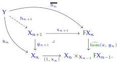

morphism (since $1 \in \mathcal{C}$ is also terminal in E), and $h_1 = \overline{h_0} : Y \to X_1 = FX_0$. Then we induce $h_{n+1}$ by the universal property of the pullback defining $X_{n+1}$:

This is valid because using the inductive assumptions about $h_n$ and $h_{n-1}$ and the properties of generalised coalgebras, we have

$$\epsilon_{X_n} \circ \overline{h_n} = h_n$$

and

$$\begin{array}{l} Fg_n \circ \overline{h_n} = \overline{g_n \circ h_n} \\ = \overline{h_{n-1}} \\ = x_n \circ h_n, \end{array}$$

and the two triangles relating to $h_{n+1}$ show that it has the necessary properties.

Now, the equations $g_{n+1} \circ h_{n+1} = h_n$ imply there is an induced map $h_\infty : Y \to X_\infty$, such that $x_\infty \circ h_\infty$ is induced by the composites $x_{n+1} \circ h_{n+1}$. But $x_{n+1} \circ h_{n+1} = \overline{h_n}$, and the morphisms $Fh_n$ induce the limit map $Fh_\infty$, so $x_\infty \circ h_\infty = \overline{h_\infty}$. Thus, by lemma 4.53, $h_\infty$ is an F-coalgebra morphism.

Finally, suppose $k : Y \to X_\infty$ is any F-coalgebra morphism, so we have $x_\infty \circ k = \overline{k}$. Then $k$ is uniquely determined by the maps $k_n : Y \to X_n$, and we have $x_{n+1} \circ k_{n+1} = \overline{k_n}$. But this equation implies by induction that $k_n = h_n$ for all $n$, hence $k = h_\infty$. $\square \triangleleft$

### 4.5.4 The general corecursor

Suppose $Y \in \text{Tel}(\Gamma, \widehat{\bullet}_{\triangle\square})$ has the structure of the premises of the corecursor from section 3.3:

$$\begin{array}{l} \Gamma, \widehat{\bullet}_{\triangle\square} \mid v : Y \vdash_{sm} \zeta v : \Phi \\ \Gamma, \widehat{\bullet}_{\triangle\square} \mid v : Y \vdash_{sm} h v : A (\zeta v) \\ \Gamma, \widehat{\bullet}_{\triangle\square} \mid v : Y \mid y : \mathcal{B}(\zeta v, h) \vdash_{sm} \tau v y : Y^d v \\ \Gamma, \widehat{\bullet}_{\triangle\square} \mid v : Y \mid y : \mathcal{B}(\zeta v, h) \vdash_{sm} \zeta^d \langle v, \tau v y \rangle = \sigma (\zeta v) (h v) y \end{array}$$

Then $\zeta$ makes it an object of the slice category $(\text{Tel} // (\Gamma, \widehat{\bullet}_{\triangle\square})) / \Phi$. We will apply theorem 4.54 to the full subcategory $\text{Tel} // (\Gamma, \widehat{\bullet}_{\triangle\square} \mid \Phi) \subseteq (\text{Tel} // (\Gamma, \widehat{\bullet}_{\triangle\square})) / \Phi$. To that end, we give $Y$ the structure of a generalised $\overline{F}$-coalgebra as follows.

Suppose $X \in \text{Tel}(\Gamma, \widehat{\bullet}_{\triangle\square} \mid \Phi)$, and suppose we have a map $g : Y \to X$ in $(\text{Tel} // (\Gamma, \widehat{\bullet}_{\triangle\square})) / \Phi$, which is to say

$$\Gamma, \widehat{\bullet}_{\triangle\square} \mid v : Y \vdash_{sm} g v : X (\zeta v).$$

89