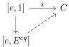

CHAPTER 3. COMPLICIAL SETS AS A MODEL OF \((\infty, \omega)\)-CATEGORIES

the functor obtained by precomposing. Remark that for any $a, n$, $(\pi^*X)(a, n) = X([a, n])$. Furthermore, we have again equalities $(f, g)^*y = x$, $(h, i)^*z = x$. As $\Delta \times B$ is Reedy elegant, this implies that $f = h$, $g = i$ and $y = z$.

If $n = 0$, then $[f, g]$ and $[h, i]$ are the identity, and we directly have $y = z$. The Reedy category $\Delta[B]$ is then elegant.

**Definition 3.1.1.8.** An *elementary anodyne extension* is one of the following:

(1) The *generating Reedy cofibrations*:

$$[a, n] \cup [b, \partial[n]] \to [b, n], \text{ for } a \to b \text{ a generating acyclic cofibration of A.}$$

(2) The *Segal extensions*:

$$[a, 1] \cup [a, 1] \cup \dots \cup [a, 1] \to [a, n], \text{ for } a \text{ an object of } A \text{ and } n > 0.$$

(3) The *completeness extensions*:

$$\{0\} \to [e, E^{eq}].$$

where $E^{eq}$ is the object defined in 1.1.2.15.

**Definition 3.1.1.9.** A *Segal A-category* is a Segal $A$-precategory having the right lifting property against all elementary anodyne extensions.

Let $C$ be a Segal $A$-categories. We define the presheaf $ho(C) : \Delta^{op} \to \text{Set}$ sending $[n]$ to $\text{Hom}_{ho(A)}(e, C_n)$. As explained in [Sim11, § 14.5], this simplicial set has the unique right lifting property against Segal's maps, and is then the nerve of a category that we also note by $ho(C)$. An arrow $x : [e, 1] \to C$ is an *isomorphism* if its image in $ho(C)$ is.

We can give an other characterization of isomorphisms in Segal $A$-categories. An arrow $x : [e, 1] \to C$ is an isomorphism if and only if there exists a lifting in the following diagram:

A morphism $f : C \to D$ between Segal $A$-categories is an *equivalence of Segal A-categories* if $C_1 \to D_1$ is a weak equivalence in $A$, and for any element $x \in ob(D)$, there exists $y \in ob(C)$ and an isomorphism in $D$ between $f(y)$ and $x$.

**Theorem 3.1.1.10** (Simpson). *There exists a nice model structure on $\text{Seg}(A)$ where fibrant objects are Segal $A$-categories and weak equivalences between Segal $A$-categories are equivalences of Segal $A$-categories.*

*A left adjoint from $\text{Seg}(A)$ to a model category $C$ is a left Quillen functor if it preserves cofibrations, and sends elementary anodyne extensions to weak equivalences.*

*Proof.* This is [Sim11, 21.2.1].

**Proposition 3.1.1.11.** *Any Segal $A$-precategory is a homotopy colimit of objects of shape $[a, n]$.*

*Proof.* Let $C$ be a Segal $A$-precategory. We have $C \cong \text{colim}_{\Delta[tB]/C}$. The result then follows from propositions 1.1.2.9, 2.1.2.6 and 3.1.1.7.

104