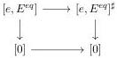
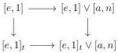

CHAPTER 3. COMPLICIAL SETS AS A MODEL OF \((\infty, \omega)\)-CATEGORIES

According to proposition 2.1.2.8, this induces a model structure on tSeg(A). By adjunction and using lemma 3.1.2.12, an object is fibrant if and only if it has the right lifting property against J, and a morphism between fibrant objects is a fibration if and only if it has the right lifting property against J. According to lemma 3.1.2.9, the fibrant objects correspond to marked Segal A-categories.

Theorem 3.1.1.10 implies that the adjunction (3.1.2.2) is a Quillen adjunction. Its unit is the identity, and lemma 3.1.2.9 implies that the counit, computed on a fibrant object \((C,C^{\cong})\), is the canonical inclusion \((C,C^{\flat})\to (C,C^{\cong})\). As this morphism is a transfinite composite of \([e,E^{eq}]\to [e,E^{eq}]^{\sharp}\), it is a weak equivalence. The Quillen pair 3.1.2.9 is then a Quillen equivalence. As a consequence, the model structure on tSeg(A) is cartesian and simplicial, and weak equivalences between fibrant objects are stratified equivalences.

It then remains to prove the last assertion. Let \( F: \mathrm{tSeg}(A) \to C \) be a left adjoint that preserves monomorphism. Suppose first that \( F \) is a left Quillen functor. As \( [e,1]_t \to [0] \) is a weak equivalence, it is send to a weak equivalence of \( C \). The restricted functor \( F(\_)^b: \mathrm{Seg}(A) \to C \) is also a left Quillen functor. As all the remaining morphisms of the assertions (1), (2) and (3) are weak equivalences of \( \mathrm{Seg}(A) \), they are send to weak equivalences of \( C \).

Suppose now that \( F \) sends the morphisms of the assertion (1), (2), (3) to weak equivalences. In particular, this implies that the restriction to \( F \) to \( \operatorname{Seg}(A) \) is a left Quillen functor. Moreover, as we have a cocartesian square

the morphism \([e,E^{eq}]^{\sharp}\to [0]\) is send to a weak equivalence, and by 2 out of 3, so are the morphism \([e,1]_t\to [e,E^{eq}]^{\sharp}\) and \([e,E^{eq}]\to [e,E^{eq}]^{\sharp}\). The functor \(F\) then sends all the morphisms of \(J\) to acyclic cofibrations, and is then a left Quillen functor.

Definition 3.1.2.14. In this model structure, the morphism \([e,1]_t\to [0]\) is a weak equivalence. For any \(a\in A\) and \(n\in \mathbb{N}\), we define \([e,1]_t\vee [a,n]\) as the pushout:

The canonical morphism \([e,1]_t\cup [a,1]\cup \ldots \cup [a,1]\to [e,1]_t\vee [a,n]\) is then a weak equivalence. By two out of three, and using the weak equivalence \([e,1]_t\to [0]\), this implies that \([e,1]_t\vee [a,n]\to [a,n]\) is a weak equivalence.

We define similarly the object \([a,n]\vee [e,1]_t\) that comes along with a weak equivalence \([a,n]\vee [e,1]_t\to [a,n]\).

Proposition 3.1.2.15. Any stratified Segal \(A\)-precategory is a homotopy colimit of objects of shape \([a, n]\) or \([e, 1]_t\).

Proof. Let \( C \) be a stratified Segal \( A \)-precategory. We have \( C \cong \operatorname{colim}_{t\Delta [tB] / C} \). The result then follows from propositions 1.1.2.9, 2.1.2.6 and 3.1.1.7.

108