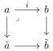

CHAPTER 3. COMPLICIAL SETS AS A MODEL OF \((\infty, \omega)\)-CATEGORIES

We extend this functor to \(\Delta_t\) by setting, for a stratified Segal \(A\)-precategory \(C\) and an integer \(n > 0\):

\[
\begin{array}{c} \coprod_ {k \geq - 1} \coprod_ {D, \tau_ {k} ^ {i} (D) = D} \coprod_ {D \to C} [ n ] \star D \longrightarrow [ n ] \star C \\ \Big \downarrow \qquad \qquad \qquad \qquad \qquad \qquad \qquad \qquad \qquad \qquad \qquad \qquad \qquad \qquad \qquad \qquad \qquad \qquad \qquad \qquad \qquad \qquad \qquad \qquad \qquad \qquad \qquad \qquad \qquad \qquad \qquad \qquad \qquad \qquad \\ \coprod_ {k \geq - 1} \coprod_ {D, \tau_ {k} ^ {i} (D) = D} \coprod_ {D \to C} \tau_ {n + k} ^ {i} ([ n ] \star D) \longrightarrow [ n ] _ {t} \star C \end{array}
\]

where \(\tau_{-1}^{i}\) is the constant functor with value \(\emptyset\). By left Kan extension, this gives a colimit preserving functor

\[
\mathrm{tPsh} (\Delta) \times \mathrm{tSeg} (A) \rightarrow \mathrm{tSeg} (A). \tag {3.2.2.2}
\]

and evaluated on the empty Segal \(A\)-category, a colimit preserving functor

\[
\mathrm{tPsh} (\Delta) \rightarrow \mathrm{tSeg} (A). \tag {3.2.2.3}
\]

The image of \(([n],\emptyset)\) (resp. \(([n]_t,\emptyset)) is noted as \([n]\) (resp. \([n]_t\)).

By construction, for \( K, L \) two stratified sets and \( D \) a stratified Segal \( A \)-precategory, we have \( K \star (L \star C) \cong (K \star L) \star C \).

Remark 3.2.2.4. We now have two functors from stratified simplicial sets to stratified Segal A-precategories. The one constructed in 3.2.1.1, and the one coming from the Gray module structure of tSeg(A) and constructed in 3.1.5.1. Moreover, Proposition 3.2.1.3 induces a weakly invertible natural transformation between them.

Both are denoted in the same way, but this should not create confusion because we will only consider the one constructed in 3.2.1.1.

Proposition 3.2.2.5. Let \( K \) be a stratified simplicial set. The morphism \( K \star_{-} \) is a left Quillen functor. Moreover, if \( i \) is a cofibration of stratified simplicial sets and \( g \) an acyclic cofibration of stratified Segal \( A \)-precategories, the morphism \( i \star g \) is an acyclic cofibration.

Proof. Since \(\star\) preserves monomorphisms, the functor \(\_ \star \_ : \Delta_{/K} \to \operatorname{End}(\mathrm{tSeg}(A))\) is Reedy cofibrant. The theorem 2.1.1.7 then implies that it is sufficient to show that for any integer \(n\), \([n] \star \_\) is a left Quillen functor. In this case, this is a repeated application of proposition 3.2.1.4. By diagram chasing and the use of two out of three, this implies the second assertion.

#### 3.2.3 Complicial horn inclusions

Notation. In this section, we will often consider morphisms  \( \tilde{a} \rightarrow \tilde{b} \)  that fit into cocartesian squares:

where \( a \to \tilde{a} \) and \( b \to \tilde{b} \) are epimorphisms. To avoid complicating the notations unnecessarily, the induced morphism \( \tilde{a} \to \tilde{b} \) will just be denoted \( i \).

118