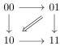
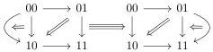

CHAPTER 1. $$(0, \omega)$$-CATEGORIES AND PRESHEAVES ON $$\Theta$$

If $$A$$ is any $$(0, \omega)$$-category, the *suspension* of $$A$$, denoted by $$[A, 1]$$, is the $$(0, \omega)$$-category having two objects - denoted by 0 and 1- and such that

$$\operatorname{Hom}_{[A,1]}(0, 1) := A, \quad \operatorname{Hom}_{[A,1]}(1, 0) := \emptyset, \quad \operatorname{Hom}_{[A,1]}(0, 0) = \operatorname{Hom}_{[A,1]}(1, 1) := \{id\}.$$

We also define $$[1] \vee [A, 1]$$ as the gluing of $$[1]$$ and $$[A, 1]$$ along the 0-target of $$[1]$$ and the 0-source of $$[A, 1]$$. We define similarly $$[A, 1] \vee [1]$$. These two objects come along with *whiskerings*:

$$\nabla : [A, 1] \to [1] \vee [A, 1] \quad \text{and} \quad \nabla : [A, 1] \to [A, 1] \vee [1]$$

that preserve the extremal points.

The $$(0, \omega)$$-category $$[1] \otimes [1]$$ is induced by the diagram:

and is then equal to the colimit of the following diagram:

$$[1] \vee [1] \xleftarrow{\nabla} [1] \hookrightarrow [[1], 1] \leftarrow [1] \xrightarrow{\nabla} [1] \vee [1].$$

The $$(0, \omega)$$-category $$[[1], 1] \otimes [1]$$ is induced by the diagram:

and is then equal to the colimit of the following diagram:

$$[1] \vee [[1], 1] \xleftarrow{\nabla} [[1] \otimes \{0\}, 1] \hookrightarrow [[1] \otimes [1], 1] \leftarrow [[1] \otimes \{1\}, 1] \xrightarrow{\nabla} [[1], 1] \vee [1]$$

We prove a formula that combines these two examples:

**Theorem 1.2.4.13.** *In the category of $$(0, \omega)$$-categories, there exists an isomorphism, natural in $$A$$, between $$[A, 1] \otimes [1]$$ and the colimit of the following diagram*

$$[1] \vee [A, 1] \xleftarrow{\nabla} [A \otimes \{0\}, 1] \longrightarrow [A \otimes [1], 1] \longleftarrow [A \otimes \{1\}, 1] \xrightarrow{\nabla} [A, 1] \vee [1]$$

We also provide similar formulas for the Gray cone, the Gray o-cone and the Gray op-cone.

**Theorem 1.2.4.14.** *There is a natural identification between $$1 \stackrel{\circ}{\star} [A, 1]$$ and the colimit of the following diagram*

$$[1] \vee [A, 1] \xleftarrow{\nabla} [A, 1] \longrightarrow [A \star 1, 1]$$

*There is a natural identification between $$[A, 1] \star 1$$ and the colimit of the following diagram*

$$[1 \stackrel{\circ}{\star} A, 1] \longleftarrow [A, 1] \xrightarrow{\nabla} [A, 1] \vee [1]$$

*There is a natural identification between $$1 \star [A, 1]$$ and the colimit of the following diagram.*

$$[1 \star A, 1] \longleftarrow [A, 1] \xrightarrow{\nabla} [1] \vee [A, 1]$$

12