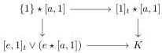
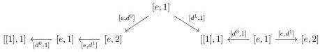
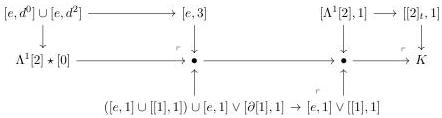
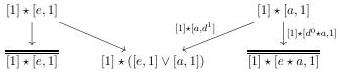

CHAPTER 3. COMPLICIAL SETS AS A MODEL OF \((\infty, \omega)\)-CATEGORIES

As the left hand morphism is a weak acyclic cofibration, so is the canonical morphism

\[
[ e, 1 ] _ {t} \vee (e \star [ a, 1 ]) \rightarrow K.
\]

We then have a commutative square

where the two horizontal morphisms and the right vertical morphism are weak equivalences. The result the follows by two out of three.

Lemma 3.2.3.14. The morphism \(\Lambda^1 [2]\star [0]\to [2]_t\star [0]\) is an acyclic cofibration.

Proof. The Segal \(A\)-precategory \([2]_t \star [0]\) is the colimit of the following diagram

\[
[ [ 2 ] _ {t}, 1 ] \longleftarrow [ [ 2 ], 1 ] \longrightarrow \overline {{[ 1 ] \star [ 1 ]}}
\]

The lemma 3.2.3.3 then implies that we have a weak equivalence from \([2]_t \star [0]\) to the colimit, denoted by \(K\), of the diagram

\[
[ [ 2 ] _ {t}, 1 ] \xleftarrow {[ d ^ {0} , 1 ]} [ [ 1 ], 1 ] \xrightarrow {[ [ 1 ] , d ^ {1} ]} [ e, 1 ] \vee (e \star [ e, 1 ])
\]

On the other side, \(\Lambda^1 [2]\star [0]\) is the colimit of the diagram

The composite \(\Lambda^1 [2]\star [0]\to [2]_t\star [0]\to K\) fits in the sequence of acyclic cofibrations

and is then a weak equivalence. By two out of three, this concludes the proof.

Lemma 3.2.3.15. The morphism \(\Lambda^1 [2]\star [a,1]\to [2]_t\star [a,1]\) is an acyclic cofibration.

Proof. The lemma 3.2.3.14 implies that the inclusion \(\Lambda^1 [2]\star [a,1]\to \Lambda^1 [2]\star [a,1]\cup [2]_t\star \{0\}\) is an acyclic cofibration. Using proposition 3.2.1.6, we deduce that the Segal \(A\) -precategory \([2]_t\star [a,1]\) is the colimit of the diagram

122