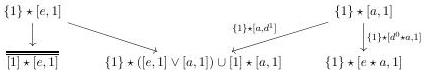
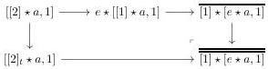
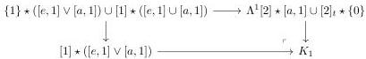
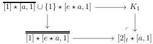
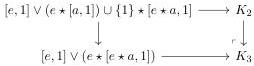

3.2. COMPLICIAL GRAY MODULE STRUCTURE ON tSeg(A)

while $\Lambda^1[2] \star [a, 1] \cup [2]_t \star \{0\}$ is the colimit of the diagram

where $\overline{[1] \star [e, 1]} := [2]_t \star [0]$ and where $\overline{[1] \star [e \star a, 1]}$ is the following pushout:

Let $K_1$ be the following pushout:

The left-hand morphism is equal to $(d^0 : [0] \to [1]) \star ([e, 1] \cup [a, 1] \to [e, 1] \lor [a, 1])$ which is an acyclic cofibration according to proposition 3.2.2.5. Furthermore, the morphism $K_1 \to [2]_t \star [a, 1]$ fits in the following pushout:

To conclude, we will prove that the left vertical morphism is a weak equivalence.

The lemma 3.2.3.3 implies that we have a weak equivalence from $[1] \star [a, 1] \cup \{1\} \star [e \star a, 1]$ to the colimit, denoted by $K_2$, of the diagram

$$[[1] \star a, 1] \xleftarrow{[d^0 \star a, 1]} [e \star a, 1] \xrightarrow{[e \star a, d^1]} [e, 1] \lor (e \star [a, 1]) \cup \{1\} \star [e \star a, 1]$$

We now define $K_3$ as the colimit of the diagram

$$[\Lambda^1[2] \star a, 1] \xleftarrow{[d^0 \star a, 1]} [[1] \star a, 1] \xrightarrow{[[1] \star a, d^1]} [e, 1] \lor (e \star [e \star a, 1])$$

The canonical morphism $K_2 \to K_3$ fits in the cocartesian square

and is then a weak equivalence according to the lemma 3.2.3.10.

On the other side, the lemma 3.2.3.3 also implies that we have a weak equivalence from $[1] \star [e \star a, 1]$ to the colimit, denoted by $K_4$, of the diagram

$$[[2]_t \star a, 1] \xleftarrow{[d^0 \star a, 1]} [[1] \star a, 1] \xrightarrow{[[1] \star a, d^1]} [e, 1] \lor (e \star [e \star a, 1])$$

123