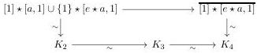
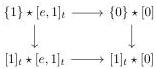
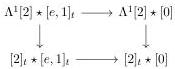

CHAPTER 3. COMPLICIAL SETS AS A MODEL OF \((\infty, \omega)\)-CATEGORIES

Remark now that all the morphisms appearing in the diagrams that define \( K_{3} \) and \( K_{4} \) are cofibrations. As \( \Lambda^1 [2] \star a \to [2]_t \star a \) is a weak equivalence in \( A \), this implies that the canonical morphism \( K_{3} \to K_{4} \) is also a weak equivalence. We then have commutative diagram:

where all arrows labelled by  \( \sim \)  are weak equivalences. By two out of three, this implies the result.

Proposition 3.2.3.16. For any stratified Segal \(A\)-precategory \(C\), the morphisms \(\Lambda^1[2] \star C \to [2]_t \star C\) and \(\{\epsilon\} \star C \to [1]_t \star C\) with \(\epsilon \in \{0,1\}\) are acyclic cofibrations. Moreover, for any cofibration of stratified Segal \(A\)-precategory \(i\), and \(j\) being either \(\{1\} \to [1]_t\) or \(\Lambda^1[2] \to [2]_t\), the morphism \(j \hat{\star} i\) is an acyclic cofibration.

Proof. We begin with the first assertion. By two out of three, we can suppose that \(\epsilon := 1\). The proposition 3.2.2.5 implies that \(\Lambda^1[2] \star_{-}\) and \([2]_t \star_{-}\) are left Quillen functors. As every object is a homotopy colimit of objects of shape \([a, n]\) or \([e, 1]_t\), we can reduce to the case where \(C\) is of this shape. Using Segal extensions, we can reduce to the case where \(C\) is \([a, 1]\), \([0]\) or \([e, 1]_t\).

If \( C \) is \([a,1]\) or \([0]\), the result follows from lemmas 3.2.3.12, 3.2.3.13, 3.2.3.14 and 3.2.3.15. Eventually, for \( C := [e,1]_t \), we have a diagram:

The proposition 3.2.2.5 and the lemmas 3.2.3.12 and 3.2.3.14 imply that all horizontal morphisms and right vertical morphisms are weak equivalences. By two out of three, this implies that the left vertical morphisms are weak equivalences.

This concludes the proof of the first assertion. The second one is obtained with some diagram chasing.

Proposition 3.2.3.17. The functor \(\mathrm{tPsh}(\Delta) \to \mathrm{tSeg}(A)\) sends complicial horn inclusions to weak equivalences.

Proof. Let \( k \leq n \) be two integers. First, we suppose that \( 0 < k < n \). We then have an equality

\[
(\Lambda^ {k} [ n ] \to [ n ] ^ {k}) = (\partial [ k - 2 ] \to [ k - 2 ]) \hat {\star} (\Lambda^ {1} [ 2 ] \to [ 2 ] _ {t}) \hat {\star} (\partial [ n - k - 2 ] \to [ n - k - 2 ]).
\]

This is an acyclic cofibration according to propositions 3.2.2.5 and 3.2.3.16. If \( k = 0 \), we have an equality

\[
(\Lambda^ {0} [ n ] \to [ n ] ^ {0}) = (\{1 \} \to [ e, 1 ] _ {t}) \hat {\star} (\partial [ n - 2 ] \to [ n - 2 ])
\]

and the right hand morphism is an acyclic cofibration again thanks to proposition 3.2.3.16. Eventually, for \( k = n \), note that

\[
(\Lambda^ {n} [ n ] \to [ n ] ^ {n}) = (\partial [ n - 2 ] \to [ n - 2 ]) \hat {\star} (\{0 \} \to [ e, 1 ] _ {t}).
\]

This morphism is an acyclic cofibration according to proposition 3.2.2.5.

124