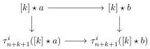
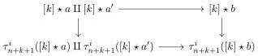
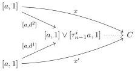
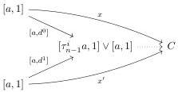

CHAPTER 3. COMPLICIAL SETS AS A MODEL OF \((\infty, \omega)\)-CATEGORIES

Definition 3.2.4.3. Let \( b \) be an object of \( A \) and \( x: a \to b \), \( x': a' \to b \) two morphisms. The element \( b \) is \( n \)-relying on \( x \) if for any \( k \geq -1 \), the following square is homotopy cocartesian:

The element \( b \) is \( n \)-relying on \( x \) and \( x' \) if for any \( k \geq -1 \), the following square is homotopy cocartesian:

Remark 3.2.4.4. We recall that we denote by \( C_{\mathrm{mk}} \) the marked Segal \( A \)-precategory associated to a stratified Segal \( A \)-precategory \( C \). The canonical inclusion \( C \to C_{\mathrm{mk}} \) is denoted \( r_C \) and is an acyclic cofibration according to the proposition 2.1.2.11. These notions and notations are defined in definition 3.2.3.1. The fact that will be used the most with the marked Segal \( A \)-precategory is their right lifting property with respect to morphisms of shape \( [\tau_n^i (a),\Lambda^1 [2]]\cup [a,2]\to [\tau_n^i (a),2] \). This fact will be used freely.

Definition 3.2.4.5. Let \( C \) be a Segal \( A \)-precategory. We define the relation \( \geq_{n} \) on morphisms of shape \( [a,1] \to C \) for \( a \) verifying \( \tau_{n}^{i}a = a \), as the smallest reflexive and transitive relation such that \( (x:[a,1] \to C) \geq_{n}(x':[a',1] \to C) \) whenever one of the three following conditions is verified:

(1) The elements \( a \) and \( a' \) are equal and there exists a lifting the following diagram:

(2) The elements \( a \) and \( a' \) are equal and there exists a lifting in the following diagram:

(3) There exists an element \( b \) which is \( (n - 1) \)-relying on \( a \to b \) and dotted arrows in the following

126