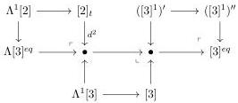
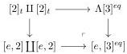
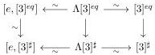

CHAPTER 3. COMPLICIAL SETS AS A MODEL OF \((\infty, \omega)\)-CATEGORIES

Proof. Let \(\Lambda[3]^{eq} \to [3]^{eq}\) be the entire inclusion generated by \(Im(d^3) \cup Im(d^0) \subset [3]\). This inclusion fits in the following sequence:

This inclusion is then a weak equivalence according to propositions 3.2.3.17 and 3.2.4.20. Now, note that we have a pushout:

As the left vertical morphism is a weak equivalence, so is the right one. Let \(\Lambda[3]^{\sharp} \to [3]^{\sharp}\) be the entire inclusion generated by \(Im(d^3) \cup Im(d^0) \subset [3]\). Using the same reasoning, we show that this cofibration is acyclic and that there is a weak equivalence \(\Lambda[3]^{\sharp} \to [e, [3]^{\sharp}]\). We then have a commutative square:

where all arrows labelled by \(\sim\) are weak equivalences. By two out of three, this implies that \([3]^{eq} \to [3]^{\sharp}\) is a weak equivalence. Combined with the proposition 3.2.2.5, this concludes the proof.

#### 3.2.6 Conclusion

Proposition 3.2.6.1. The stratified cosimplicial object constructed in 3.2.2.1 induces a Quillen adjunction \(\mathrm{tPsh}(\Delta)^{\omega}\to \mathrm{tSeg}(A)\).

Proof. It is a direct consequence of theorem 2.2.1.8 and propositions 3.2.3.17, 3.2.4.20, and 3.2.5.1. \(\square\)

Theorem 3.2.6.2. Let \( A \) be a complicial Gray module. The Gray module structure on \( \mathrm{tSeg}(A) \) given by theorem 3.1.4.8 is complicial.

Proof. The constructions 3.1.5.1 and 3.2.1.1 provide two functors \(\mathrm{tPsh}(\Delta) \times \mathrm{tSeg}(A) \to \mathrm{tSeg}(A)\). Moreover, the proposition 3.2.1.3 implies that they are weakly equivalent. By propositions 3.2.3.16 and 3.2.6.1, the functor of construction 3.2.1.1 fulfills all the conditions of the definition 3.1.5.4, and so does the one of construction 3.1.5.1.

### 3.3 Complicial sets as of model of  \( (\infty, n) \) -categories

#### 3.3.1 The case \(n < \omega\)

Construction 3.3.1.1. Let \( n \in \mathbb{N} \cup \{\omega\} \). We recall that \( \mathrm{tPsh}(\Delta)^n \) is the category of stratified simplicial sets endowed with the model structure for \( n \)-complicial sets given in theorem 2.2.1.8. As remarked in

134