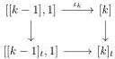
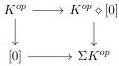
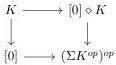

3.3. COMPLICIAL SETS AS OF MODEL OF \((\infty, n)\)-CATEGORIES

example 3.1.5.7, \(\mathrm{tPsh}(\Delta)^{\omega}\) is a complicial Gray module, and according to proposition 3.2.6.1, it is endowed with a left Quillen functor

\[
i ^ {\omega}: \mathrm{tPsh} (\Delta) ^ {\omega} \to \mathrm{tSeg} (\mathrm{tPsh} (\Delta)) ^ {\omega}
\]

It was noted in definition 3.2.4.16 that for \( k > 0 \), \( [k] \to [k]_t \) fits in the following cocartesian square:

The functor \( i^{\omega} \) then induces for any integer \( n < \omega \), a left Quillen functor

\[
i ^ {n + 1}: \mathrm{tPsh} (\Delta) ^ {n + 1} \rightarrow \mathrm{tSeg} (\mathrm{tPsh} (\Delta) ^ {n}) \tag {3.3.1.2}
\]

Definition 3.3.1.3. Let \( k \) be an integer. The \( k \)-globe of \( \mathrm{tSeg}(\mathrm{tPsh}(\Delta)^n) \) is [0] if \( k = 0 \) and \( [\mathbf{D}_{k-1}, 1] \) if \( k > 0 \) where \( \mathbf{D}_k \) is the stratified simplicial set constructed in definition 2.4.1.1. This assignment extends to a functor \( G \to \mathrm{tSeg}(\mathrm{tPsh}(\Delta)^n) \).

Construction 3.3.1.4. In the category of stratified simplicial sets, we define \(\tilde{\mathbf{D}}_0 := [0]\), and for all integer \(k > 0\), \(\tilde{\mathbf{D}}_k := (\Sigma \mathbf{D}_{k-1}^{op})^{op}\). This assignation lifts to a functor \(\mathrm{G} \to \mathrm{tPsh}(\Delta)\) that sends \(i_0^\epsilon\) on \(i_0^\epsilon : [0] \to \Sigma[0]\), and \(i_k^\epsilon\) to \((\Sigma i_{k-1}^{-\epsilon})^{op} : (\Sigma \mathbf{D}_{k-1}^{op})^{op} \to (\Sigma \mathbf{D}_k^{op})^{op}\) for \(k > 0\) and \(\epsilon \in \{-, +\}\).

Lemma 3.3.1.5. There exists a natural zigzag of weak equivalences of \(\mathrm{tSeg}(\mathrm{Psh}(\Delta)^{\omega})\)

\[
\mathbf {D} _ {k} \rightsquigarrow \tilde {\mathbf {D}} _ {k}.
\]

Proof. As the functor \(\mathrm{R}:\mathrm{tPsh}(\Delta)\to (0,\omega)\)-cat preserves suspension and the op duality, we have \(\mathrm{R}(\mathbf{D}_k)\cong\) \(\mathrm{R}(\tilde{\mathbf{D}}_k)\). We then have two natural transformations

\[
\mathbf {D} _ {-} \rightarrow \mathrm{N} (\mathbf {D} _ {-}) \leftarrow \tilde {\mathbf {D}} _ {-}
\]

which are weak equivalences according to theorem 2.2.3.3.

Lemma 3.3.1.6. Let \( K, L \) be two stratified simplicial sets, and \( i^{\omega}(L) \rightsquigarrow [K,1] \) a zigzag of weak equivalence of \( \mathrm{tPsh}(\Delta)^{\omega} \). This induces a zigzag \( i^{n+1}((\Sigma L^{op})^{op})) \rightsquigarrow [(\Sigma K^{op})^{op},1] \) of weak equivalences.

Proof. We recall that \(\Sigma^{\star}:\mathrm{tPsh}(\Delta)^{\omega}\to \mathrm{tPsh}(\Delta)^{\omega}\) is the functor defined in construction 2.2.2.15 that sends \(X\) to \([0]\coprod_X X\star [0]\) and that we have a weak equivalence \(\Sigma X\to \Sigma^{\star}X\) natural in \(X\) defined in (2.2.2.16). This induces a weak equivalence \((\Sigma X^{op})^{op}\to (\Sigma^{\star}X^{op})^{op}\) natural in \(X\).

By proposition 2.2.2.11, applying the duality \((\_)^{op}\) to the cocartesian square of stratified simplicial sets

we get a cocartesian square

135