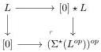
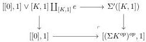

CHAPTER 3. COMPLICIAL SETS AS A MODEL OF \((\infty, \omega)\)-CATEGORIES

We denote by \(\Sigma': \mathrm{tSeg}(\mathrm{tPsh}(\Delta)^\omega) \to \mathrm{tSeg}(\mathrm{tPsh}(\Delta)^\omega)\) the functor sending \(C\) to \([0] \star C \coprod_X [0]\). Remark that by construction, we have a cocartesian square

and then a natural isomorphism \( i^{\omega}((\Sigma^{*}(L^{op}))^{op}) \cong \Sigma' i^{\omega}(L) \).

By proposition 3.2.1.6, for any stratified simplicial sets \(K\), \(\Sigma'([K,1])\) is the colimit of the diagram:

\[
[ [ 0 ] \diamond K, 1 ] \xleftarrow {[ d ^ {0} * K , 1 ]} [ K, 1 ] \xrightarrow {[ e , d ^ {1} ]} [ [ 0 ], 1 ] \vee [ K, 1 ] \xleftarrow {[ e , d ^ {0} ]} [ K, 1 ] \longrightarrow [ 0 ]
\]

Combined with the previous cocartesian square of stratified simplicial sets, we get a cocartesian square

and as the left vertical morphism is a weak equivalence, so is the right vertical one. We then have constructed a natural transformation

\[
\Sigma^ {\prime} [ K, 1 ] \rightarrow [ (\Sigma K ^ {o p}) ^ {o p}, 1 ]
\]

that is pointwise a weak equivalence.

Let \( K, L \) be two stratified simplicial sets, and \( i^{\omega}(L) \rightsquigarrow [K, 1] \) a zigzag of weak equivalence. We then have natural weak equivalences

\[
\begin{array}{l} i ^ {\omega} ((\Sigma L ^ {o p}) ^ {o p})) \rightarrow i ^ {\omega} ((\Sigma^ {*} L ^ {o p}) ^ {o p}) \\ \cong \Sigma^ {\prime} (i ^ {\omega} (L)) \\ \leftrightarrow \Sigma^ {\prime} [ K, 1 ] \\ \rightarrow [ (\Sigma K ^ {o p}) ^ {o p}, 1 ] \\ \end{array}
\]

Proposition 3.3.1.7. For all \( n \in \mathbb{N} \cup \{\omega\} \), the functor \( i^{n+1} \) preserves globes up to zigzag of weak equivalence.

Proof. It is sufficient to demonstrate the result when \( n = \omega \). We construct by induction on \( k \) a zigzag of weak equivalence \( i^{\omega}(\mathbf{D}_k) \rightsquigarrow \mathbf{D}_k \). The initialization is obvious as we have \( i^{\omega}(\mathbf{D}_0) \cong \mathbf{D}_0 \) and \( i^{\omega}(\mathbf{D}_1) \cong \mathbf{D}_1 \). Suppose then the zigzag constructed at the stage \( k \). Using Lemmas 3.3.1.5 and 3.3.1.6, we have a zigzag of weak equivalences

\[
i ^ {n + 1} (\mathbf {D} _ {k}) \leftrightarrow i ^ {n + 1} (\tilde {\mathbf {D}} _ {k}) \leftrightarrow [ \mathbf {D} _ {k - 1} ^ {\sim}, 1 ] \leftrightarrow [ \mathbf {D} _ {k - 1}, 1 ]
\]

Construction 3.3.1.8. We define the colimit-preserving functor

\[
j ^ {\omega}: \mathrm{tSeg} (\mathrm{tPsh} (\Delta) ^ {\omega}) \rightarrow \mathrm{tPsh} (\Delta) ^ {\omega} \tag {3.3.1.9}
\]

136