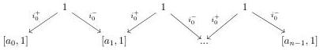
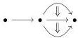

CHAPTER 1. $$(0, \omega)$$-CATEGORIES AND PRESHEAVES ON $$\Theta$$

### 1.1.2 The category $$\Theta$$

Definition 1.1.2.1. Let $$n$$ be a non negative integer and $$\mathbf{a} := \{a_0, a_1, ..., a_{n-1}\}$$ a sequence of $$(0, \omega)$$-categories. We denote $$[\mathbf{a}, n]$$ the colimit of the following diagram

where $$[\_, 1]$$ is the suspension functor defined in 1.1.1.7.

Definition 1.1.2.2. We define $$\Theta$$ as the smallest full subcategory of $$(0, \omega)$$-cat that includes the terminal $$(0, \omega)$$-category $$[0]$$, and such that for any non negative integer $$n$$, and any finite sequence $$\mathbf{a} := \{a_0, a_1, ..., a_{n-1}\}$$ of objects of $$\Theta$$, it includes the $$(0, \omega)$$-category $$[\mathbf{a}, n]$$. Objects of $$\Theta$$ are called globular sum.

Remark 1.1.2.3. A morphism $$g : [\mathbf{a}, n] \to [\mathbf{b}, m]$$ is exactly the data of a morphism $$f : [n] \to [m]$$, and for any integer $$i$$, a morphism

$$a_i \to \prod_{f(i) \le k < f(i+1)} b_k.$$

Example 1.1.2.4. For any $$n$$, $$\mathbf{D}_n$$ is a globular sum. The $$(0, \omega)$$-category induced by the $$\omega$$-graph

is a globular sum.

Definition 1.1.2.5. For a globular sum $$a$$ and an integer $$n$$, we define $$[a, n] := [\{a, a, ..., a\}, n]$$. For a sequence of integer $$\{n_0, .., n_k\}$$ and a sequence of globular sum $$\{a_0, .., a_k\}$$, we define $$[a_0, n_0] \lor [a_1, n_1] \lor ... \lor [a_k, n_k]$$ as the globular sum $$[\{a_0, .., a_1, ..., a_k, ...\}, n_0 + n_1 + ... + n_k]$$.

We denote by $$[0]$$ the terminal $$(\infty, \omega)$$-category, and $$[n]$$ the globular sum $$[[0], n]$$. This induces a fully faithful functor $$\Delta \to \Theta$$ sending $$[n]$$ onto $$[n]$$..

Definition 1.1.2.6. We define by induction the dimension of a globular sum $$a$$, denoted by $$|a|$$. The dimension of $$[0]$$ is 0, and the dimension of $$[\mathbf{a}, n]$$ is the maximum of the set $$\{|a_k| + 1\}_{k < n}$$. We denote by $$\Theta_n$$ the full subcategory of $$\Theta$$ whose objects are the globular sum of dimension inferior or equal to $$n$$. We set by convention $$\Theta_\omega := \Theta$$.

Notation 1.1.2.7. We set by convention $$\omega + 1 := \omega$$.

An important property of the category $$\Theta$$ is that it is a Reedy elegant.

Definition 1.1.2.8. A Reedy category is a small category $$A$$ equipped with two subcategories $$A_+$$, $$A_-$$ and a degree function $$d : ob(A) \to \mathbb{N}$$ such that:

(1) for every non identity morphism $$f : a \to b$$, if $$f$$ belongs to $$A_-$$, $$d(a) > d(b)$$, and if $$f$$ belongs to $$A_+$$, $$d(a) < d(b)$$.

16