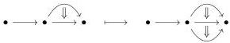
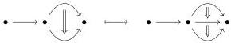

1.1. BASIC CONSTRUCTIONS

(2) every morphism of $A$ uniquely factors as a morphism of $A_{-}$ followed by a morphism of $A_{+}$.

A Reedy category $A$ is *elegant* if for any presheaf $X$ on $A$, for any $a \in A$ and any $c \in X(a)$, there exists a unique morphism $f : a \to a' \in A_{-}$ and a unique non degenerate object $c' \in X(a')$ such that $c = X(f)(c')$.

**Proposition 1.1.2.9.** *Let $X$ be a presheaf on an elegant Reedy category $A$. The category $A_{/X}$ is an elegant Reedy category.*

*Proof.* We have a canonical projection $\pi : A_{/X} \to A$. A morphism is positive (resp. negative) if it's image by $\pi$ is. The degree of an element $c$ of $A_{/X}$ is the degree of $\pi(c)$. We leave it to the reader to check that this endows $A_{/X}$ with a structure of Reedy category.

The fact that $A_{/X}$ is elegant is a direct consequence of the isomorphism $\mathrm{Psh}(A_{/X}) \cong \mathrm{Psh}(A)_{/X}$. $\square$

**Proposition 1.1.2.10** (Berger, Bergner-Rezk). *For any $n \in \mathbb{N} \cup \{\omega\}$, the category $\Theta_n$ are elegant Reedy category.*

*A morphism $g : [\mathbf{a}, n] \to [\mathbf{b}, m]$ is degenerate (i.e a morphism of $\Theta_{-}$) if the corresponding morphism $f : [n] \to [m]$ is a degenerate morphism of $\Delta$, and for any $i < n$ and any $f(i) \leq k < f(k+1)$, the corresponding morphism $a_i \to b_k$ is degenerate. Furthermore, a morphism is degenerate if and only if it is a epimorphism in $\mathrm{Psh}(\Theta)$.*

*A morphism is in $\Theta^{+}$ if and only if it is a monomorphism in $\mathrm{Psh}(\Theta)$.*

*Proof.* The Reedy structure is a consequence of lemma 2.4 of [Ber02]. The fact that for any $n < \omega$, $\Theta_n$ is elegant is [BR13, corollary 4.5.]. As for any $n < \omega$, the inclusion $\Theta_n \to \Theta$ preserves strong pushout, the characterization of elegant Reedy category given by [BR13, proposition 3.8.] implies that $\Theta$ is also elegant. $\square$

**Definition 1.1.2.11.** We recall that a morphism $g : [\mathbf{a}, n] \to [\mathbf{b}, m]$ is exactly the data of a morphism $f : [n] \to [m]$, and for any integer $i$, a morphism

$$a_i \to \prod_{f(i) \leq k < f(i+1)} b_k.$$

The morphism $g$ is *globular* if for any $k < n$, $f(k+1) = f(k) + 1$ and the morphism $a_k \to b_k$ is globular. The morphism $g$ is *algebraic* if it cannot be written as a composite $ig'$ where $i$ is a globular morphism.

**Example 1.1.2.12.** The morphism

is globular. This is not the case for the morphism

that sends the 2-cell of the left globular sum on the 1-composite of the two 2-cells of the right globular sum.

17