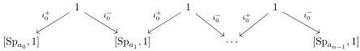
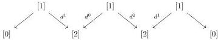
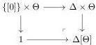

CHAPTER 1. (0, ω)-CATEGORIES AND PRESHEAVES ON Θ

**Proposition 1.1.2.13** ([Ara10, Proposition 3.3.10]). *Every morphism in Θ can be factored uniquely in an algebraic morphism followed by a globular morphism.*

**Remark 1.1.2.14.** Globular morphisms belong to Θ₊ (and so morphisms of Θ₋ are algebraic) but the converse is false. For example, the second morphism of example 1.1.2.12 is not globular but belongs to Θ₊. We then have two different factorizations on Θ: the one coming from the Reedy elegant structure, and the one given in proposition 1.1.2.13.

**Definition 1.1.2.15.** The suspension functor [_, 1] : Θ → Θ induces by left Kan extension a functor

$$[\_, 1] : \mathrm{Psh}(\Theta) \to \mathrm{Psh}(\Theta).$$

We define by induction on a → Θ-presheaf Spₐ and a morphism Spₐ → a. If a is [0], we set Sp[0] := [0]. For n > 0, we define Sp[ₐ,ₙ] as the set valued presheaf on Θ obtained as the colimit of the diagram

We define Eᵉq as the set valued preheaves on Δ obtained as the colimit of the diagram

For any integer n, the functor Σⁿ : Θ → Θ, which is the n-iteration of [_, 1], induces by left Kan extension a functor

$$\Sigma^n : \mathrm{Psh}(\Theta) \to \mathrm{Psh}(\Theta).$$

We define two sets of morphisms of Psh(Θ):

$$\mathrm{W}_{\mathrm{Seg}} := \{\mathrm{Sp}_a \to a, a \in \Theta\} \quad \mathrm{W}_{\mathrm{Sat}} := \{\Sigma^n E^{eq} \to \mathbf{D}_n\}$$

and we set

$$\mathrm{W} := \mathrm{W}_{\mathrm{Seg}} \cup \mathrm{W}_{\mathrm{Sat}}.$$

For any n, we also define

$$\mathrm{W}_n := \mathrm{W} \cap \Theta_n.$$

**Definition 1.1.2.16.** We recall that for an integer n and a globular sum a, we defined [a, n] := [{a, a, ..., a}, n]. This defines a functor i : Δ[Θ] → Θ sending (n, a) on [a, n] where Δ[Θ] is the following pushout of category:

For the sake of simplicity, we will also denote by [a, n] (resp. [n]) the object of Δ[Θ] corresponding to (n, a) (resp. to (n, [0])). We define two sets of morphisms:

$$\mathrm{M}_{\mathrm{Seg}} := \{[a, \mathrm{Sp}_n] \to [a, n], a : \Theta\} \cup \{[f, 1], f \in \mathrm{W}_{\mathrm{Seg}}\}$$

$$\mathrm{M}_{\mathrm{Sat}} := \{E^{eq} \to [0]\} \cup \{[f, 1], f \in \mathrm{W}_{\mathrm{Sat}}\}$$

18