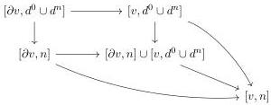

1.1. BASIC CONSTRUCTIONS

the left Kan extension of the functor $\Theta \times \Delta \to \mathrm{Psh}(\Delta[\Theta])$ sending $(a, n)$ onto $[a, n]$. For an integer $n$, we denote

$$[\_, n] : \mathrm{Psh}(\Theta)^n \to \mathrm{Psh}(\Theta)$$

the left Kan extension of the functor $\Theta^n \to \mathrm{Psh}(\Theta)$ sending $\mathbf{a} := \{a_1, ..., a_n\}$ onto $[\mathbf{a}, n]$. Eventually, we define

$$[\_, d^0 \cup d^n] : \mathrm{Psh}(\Theta)^n \to \mathrm{Psh}(\Theta)$$

the left Kan extension of the functor $\Theta^n \to \mathrm{Psh}(\Theta)$ sending $\mathbf{a} := \{a_1, ..., a_n\}$ onto the colimit of the span.

$$[\{a_0, ..., a_{n-2}\}, n-1] \leftarrow [\{a_1, ..., a_{n-2}\}, n-2] \to [\{a_1, ..., a_{n-1}\}, n-1]$$

Lemma 1.1.3.6. The image of $\overline{\mathbf{W}} \times \overline{\mathbf{W}_1}$ by the functor $[\_, \_] : $\mathrm{Psh}(\Theta) \times \mathrm{Psh}(\Delta) \to \mathrm{Psh}(\Delta[\Theta])$ is included in $\overline{\mathbf{W}}$.

Proof. As $[\_, \_]$ preserves colimits and monomorphisms, it is enough to show that for any pair $f, g \in \mathbf{W} \times \mathbf{W}_1$, $[f, g]$ is in $\mathbf{W}$, which is obvious.

Lemma 1.1.3.7. For any globular sum $v$, and any integer $n$, the morphism $[v, d^0 \cup d^n] \cup [\partial v, n] \to [v, n]$ appearing in the diagram

is in $\overline{\mathbf{M}}$.

Proof. Let $a$ be a globular sum. Remark that the morphism $[a, \mathrm{Sp}_n] \to [a, d^0 \cup d^n]$ is in $\overline{\mathbf{M}}$. By left cancellation, this implies that $[a, d^0 \cup d^n] \to [a, n]$ is in $\overline{\mathbf{M}}$. Let $X$ be a presheaf on $\Theta$. As $X$ is a colimit of globular sum indexed by the Reedy cofibrant diagram $\Theta_{/X} \to \mathrm{Psh}(\Theta)$ (definition 1.1.3.1), and as $[\_, d^0 \cup d^n] \to [\_, n]$ preserve cofibrations, this implies that $[X, d^0 \cup d^n] \to [X, n]$ is in $\overline{\mathbf{M}}$. In particular, $[\partial v, d^0 \cup d^n] \to [\partial v, n]$ is in $\overline{\mathbf{M}}$, and so is $[v, d^0 \cup d^n] \to [\partial v, n] \cup [v, d^0 \cup d^n]$ by stability by coproduct. A last use of the stability by left cancellation then concludes the proof.

Definition 1.1.3.8. Let $[b, m]$ be an element of $\Delta[\Theta]$. We denote $\mathrm{Hom}^*(i([b, m]), [\mathbf{a}, n])$ the subset of $\mathrm{Hom}(i([b, m]), [\mathbf{a}, n])$ that consists of morphisms that preserve extremal objects. The explicit expression of morphism in $\Theta$ given in remark 1.1.2.3 implies the bijection:

$$\mathrm{Hom}^*(i([b, m]), [\mathbf{a}, n]) \cong \mathrm{Hom}_\Delta([n], [m])^* \times \prod_{i < n} \mathrm{Hom}_\Theta(b, a_i) \tag{1.1.3.9}$$

where $\mathrm{Hom}^*(_\Delta[n], [m])$ is the subset of $\mathrm{Hom}_\Delta([n], [m])$ consisting of morphisms that preserve extremal objects.

Let $\mathbf{a} := \{a_0, a_1, ..., a_{n-1}\}$ be a finite sequence of globular sums. We define $\Theta_{/\mathbf{a}}^*$ as the category whose objects are collections of maps $\{b \to a_i\}_{i < n}$ such that there exists no degenerate morphism $b \to b'$ factorizing all $b \to a_i$. Morphisms are monomorphisms $b \to b'$ making all induced triangles commute.

21