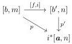
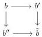
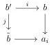

CHAPTER 1. (0, ω)-CATEGORIES AND PRESHEAVES ON Θ

The bijection (1.1.3.9) induces a bijection between the objects of Θ→/a and the morphisms [b, n] → i*[a, n] that are the identity on objects and that can not be factored through any degenerate morphism [b, n] → [b̄, n].

Lemma 1.1.3.10. For any morphism p : [b, m] → i*[a, n] in Psh(Δ[Θ]) that preserves extremal objects, there exists a unique pair ({b' → a_i}i<n, [f, i] : [b, m] → [b', n]) where {b' → a_i}i<n is an element of Θ→/a, f is a degenerate morphism, and such that the induced triangle

commutes.

Proof. By adjunction and thanks to the bijection (1.1.3.9), p corresponds to a pair (j : [m] → [n], {b → a_i}i<n), and i has to be equal to j.

Using once again this bijection, and the fact that degeneracies are epimorphisms, we have to show that there exists a unique degenerate morphism g : b → b' that factors the morphisms b → a_i for all i < n, and such that the induced family of morphisms {b' → a_i}i<n is an element of Θ→/a.

As any infinite sequence of degenerate morphisms is constant at some point, the existence is immediate.

Suppose given two morphisms b → b', b → b'' fulfilling the previous condition. The proposition 3.8 of [BR13] implies that there exists a globular sum b̃ and two degenerate morphisms b' → b̃ and b'' → b̃ such that the induced square

is cartesian. The universal property of pushout implies that b → b̃ also fulfills the previous condition. By definition of b' and b'', this implies that they are equal to b̃, and this shows the uniqueness. □

Lemma 1.1.3.11. Let {b → a_i}i<n be an element of Θ→/a and i : b' → b a monomorphism of Θ. The induced family {b' → b → a_i}i<n is an object of Θ→/a.

Proof. The lemma 1.1.3.10 implies that there exists a unique degenerate morphism j : b' → b̃ that factors all the morphism b' → b → a_i for i < n, and such the induced family of morphisms {b̃ → a_i}i<n is an element of Θ→/a. We proceed by contradiction, and we then suppose that j is different from the identity.

We then have, for any i < n, a commutative square

As the morphism j is degenerate and different of the identity, there exists an integer k and a non trivial k-cell d of b' that is sent to an identity by j. Now, let d' be a k-generator of the polygraph b that appears in the decomposition of i(d). The commutativity of the previous square and the fact that the (0, ω)-categories a_i are polygraphs implies that for any i, the k-cell a' is sent to an identity by the morphism

22