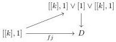
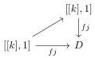
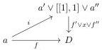
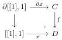

CHAPTER 1. \((0,\omega)\)-CATEGORIES AND PRESHEAVES ON \(\Theta\)

and if \( j \) is different of \( d \) by share the same 0-source and 0-target, we consider the diagram

where these two decompositions are induced by lemma 1.2.2.11. If the 0-source and 0-target of \( j \) are different of the one of \( d \), we consider the diagram

Taking the colimit over all such \(j: [[k], 1] \to a\), this induces a factorization

fulfilling the desired property. Eventually, the functoriality of this factorization is a consequence of the unicity of the decomposition given in lemma 1.2.2.11 and of lemma 1.2.2.8.

Until the end of this section, we fix an other  \( (0,2) \) -category C admitting a loop-free and atomic basis, and fitting in a cocartesian square of  \( (0,\omega) \) -cat of shape:

Construction 1.2.2.20. We define \(\Gamma_0\) as the full subcategory of \((\Theta_2)_{/D}\) whose objects are morphisms \(f:a\to D\) such that either \(f\) factors through \(C\), or the following conditions are fulfilled:

(1) \(f(\nabla)\) is 0-comparable with \(x\).
(2) \(\mathrm{Sp}_a\to a\to D\) factors through the \(\Theta\) -set \(C\cup x\)

We define \(\Gamma_1\) as the full subcategory of \((\Theta_2)_{/D}\) whose objects are morphisms \(v:a\to D\) such that \(\mathrm{Sp}_a\to a\to D\) factors through the \(\Theta\)-set \(C\cup \mathrm{colim}_{\Gamma_0}a\).

Lemma 1.2.2.21. The canonical morphism of \(\Theta\)-sets \(\iota: \operatorname{colim}_{\Gamma_0} a \to D\) is injective. Its image corresponds to morphisms \(f: a \to D\) such that either \(f\) factors through \(C\), or the 2-cell \(f(\nabla)\) is 0-comparable with \(x\).

Proof. First, remark that the morphism \( C \to \operatorname{colim}_{\Gamma_0} a \) is injective. To complete the characterization of the image of \( \iota \), let \( f: a \to D \) be a morphism such that \( f(\nabla) \) is 0-comparable with \( x \).

Consider now the factorization \( a \xrightarrow{i} a' \xrightarrow{g} D \) of \( f \) given by lemma 1.2.2.19. Every element of \( \mathrm{Sp}a' \) is sent to either an element of \( C \) or to \( x \). This implies that \( g \) belongs to \( \Gamma_0 \), which concludes the characterization of the image of \( \iota \).

36