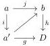
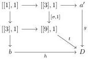

1.2. GRAY OPERATIONS

Now, for the injectivity, suppose that there exists another element $h : b \to D$ of $\Gamma_0$ and a decomposition $a \xrightarrow{j} b \xrightarrow{h} D$ of $f : a \to D$. Up to further factorization, we can suppose that $j$ is algebraic and, according to lemma 1.2.2.19, that $j(\nabla)$ is 0-comparable with the (necessarily unique) element of the basis $c$ of $b$ such that $g(c) = x$.

Using once again the factorization lemma 1.2.2.19 on the morphism $j$ and the object $c$, and using the functoriality of this factorization, we get a commutative diagram

completing the proof of injectivity.

**Lemma 1.2.2.22.** *The canonical morphism of $\Theta$-sets $\iota : \operatorname{colim}_{\Gamma_1} a \to D$ is an equivalence.*

*Proof.* First, remark that the morphism $C \to \operatorname{colim}_{\Gamma_1} a$ is injective. To complete the surjectivity of $\iota$, let $f : a \to D$ be a morphism such that $x$ belongs to $[f(\nabla)]_2$. We denote by $c$ as the (necessary) unique element of the base of $a$ such that $x \in [f(c)]_2$.

Let $k \leq 1$ and $j : [[k], 1] \to \operatorname{Sp}_a$ be an element of the basis. If $j$ is $c$, we consider the following diagram

$$[[1], 1] \to [[3], 1] \to D$$

induced by the decomposition of lemma 1.2.2.11. Moreover, lemma 1.2.2.21 implies that $l$ belongs to $\Gamma_1$. If $j$ is different from $c$, we consider the diagram

$$[[k], 1] \to [[k], 1] \to D$$

Moreover, $fj$ factors through $C$ and then belongs to $\Gamma_1$. Taking the colimit over all such $j$, this induces a diagram

$$a \xrightarrow{i} a' \xrightarrow{g} D$$

whose composite is $f$ and such that $g$ is in $\Gamma_1$. This concludes the proof of the surjectivity of $\iota$.

To prove the injectivity, suppose now that there exists another element $h : b \to D$ and a decomposition $a \xrightarrow{j} b \xrightarrow{h} D$ of $f : a \to D$ with $h$ in $\Gamma_1$. If $j$ is $c$, we consider the diagram

where the left vertical morphisms are induced by the decomposition of lemma 1.2.2.11, the morphism $t$ obtained in applying for each 2-cell the decomposition of lemma *op cit*, and the morphism $\sigma$ send 0 on 0, 1 on 1, 2 on 8 and 3 on 9. The commutativity of this diagram is a consequence of lemma 1.2.2.15.

37