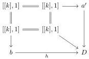
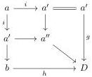

CHAPTER 1. (0, ω)-CATEGORIES AND PRESHEAVES ON Θ

If j is different from c, we consider the diagram

Taking the colimit over all such j, this induces a diagram

where a'' → D is in Γ₁, which concludes the proof of injectivity.

Lemma 1.2.2.23. Let f : a → D be a morphism of Γ₀. We denote by Λ^Γ₀ a the subobject of a composed of all i ∈ Θ₂/ₐ such that fi factors through the Θ₂-set C ∪ x. Then the morphism Λ^Γ₀ a → a is in W̅₂.

Proof. If f factors through C, then Λ^Γ₀ a is equal to a. Suppose then that there exists a (necessarily unique) element of the base b such that f(b) = x.

There exists a unique decomposition of a as

$$a \cong a' \vee [[k] \vee [1] \vee [k'], 1] \vee a''$$

where the cell [[1], 1] → a is b and where

$$[[k], 1] \to a \to D \quad \text{and} \quad [[k'], 1] \to a \to D$$

factors through C.

We then have

$$\Lambda^{\Gamma_0} a \cong a' \vee [[k] \coprod_{[0]} [1] \coprod_{[0]} [k'], 1] \vee a''$$

As the functor a' ∨ [_, 1] ∨ a : Psh(Δ) → Psh(Θ) sends W̅₁ to W̅₂, and as

$$[k] \coprod_{[0]} b \coprod_{[0]} [k'] \to [k + 1 + k']$$

is in W̅₁, this concludes the proof.

Lemma 1.2.2.24. Let f : a → D be a morphism of Γ₁. We denote by Λ^Γ₁ a the subobject of a composed of all i ∈ Θ/ₐ such that fi factors through colim_Γ₀ a. Then the morphism Λ^Γ₁ a → a is in W̅₂.

Proof. If f factors through C, then Λ^Γ₁ a is equal to a. Suppose then that there exists a (necessarily unique) element of the base b such that x belongs to [f(b)]₂.

38