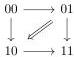
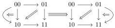
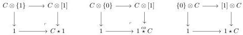

CHAPTER 1. $$(0, \omega)$$-CATEGORIES AND PRESHEAVES ON $$\Theta$$

where $$\epsilon$$ is either $$+$$ or $$-$$, $$k \leqslant n$$ and $$e_n^+ = e_n^-$$. Their source and target are given as follows:

$$\pi^-(e_k^\epsilon \otimes \{0\}) = e_{k-1}^- \otimes \{0\} \quad \pi^+(e_k^\epsilon \otimes \{0\}) = e_{k-1}^+ \otimes \{0\}$$

$$\pi^-(e_k^\epsilon \otimes \{1\}) = e_{k-1}^- \otimes \{1\} \quad \pi^+(e_k^\epsilon \otimes \{1\}) = e_{k-1}^+ \otimes \{1\}$$

$$\pi^-(e_{2k}^\epsilon \otimes [1]) = \dots \circ_2 (e_0^+ \otimes [1]) \circ_0 (e_{2k}^\epsilon \otimes \{0\}) \circ_1 (e_1^- \otimes [1]) \circ_3 \dots \circ_{2k-1} (e_{2k-1}^- \otimes [1])$$

$$\pi^+(e_{2k}^\epsilon \otimes [1]) = (e_{2k-1}^+ \otimes [1]) \circ_{2k-1} \dots \circ_3 (e_1^+ \otimes [1]) \circ_1 (e_{2k}^\epsilon \otimes \{1\}) \circ_0 (e_0^- \otimes [1]) \circ_2 \dots$$

$$\pi^-(e_{2k+1}^\epsilon \otimes [1]) = \dots \circ_3 (e_1^+ \otimes [1]) \circ_1 (e_{2k+1}^\epsilon \otimes \{1\}) \circ_0 (e_0^- \otimes [1]) \circ_2 \dots \circ_{2k} (e_{2k}^- \otimes [1])$$

$$\pi^+(e_{2k+1}^\epsilon \otimes [1]) = (e_{2k}^+ \otimes [1]) \circ_{2k} \dots \circ_2 (e_0^+ \otimes [1]) \circ_0 (e_{2k+1}^\epsilon \otimes \{0\}) \circ_1 (e_1^- \otimes [1]) \circ_3 \dots$$

We did not put parenthesis in the expression above, to keep them shorter, the default convention is to do the composition $$\circ_i$$ in order of increasing values of $$i$$.

**Example 1.2.4.7.** The $$(0, \omega)$$-category $$\mathbf{D}_1 \otimes [1]$$ is the polygraph:

The $$(0, \omega)$$-category $$\mathbf{D}_2 \otimes [1]$$ is the polygraph:

**Construction 1.2.4.8.** We define the *Gray cone*, the *Gray o-cone* and the *Gray op-cone*:

$$\begin{array}{c c c c c c c c} (0, \omega)\text{-cat} & \to & (0, \omega)\text{-cat.} & (0, \omega)\text{-cat} & \to & (0, \omega)\text{-cat.} & (0, \omega)\text{-cat} & \to & (0, \omega)\text{-cat.} \\ C & \mapsto & C \star 1 & C & \mapsto & 1 \stackrel{co}{\star} C & C & \mapsto & 1 \star C \end{array}$$

where $$C \star 1$$, $$1 \stackrel{co}{\star} C$$ and $$1 \star C$$ are defined as the following pushouts:

**Remark 1.2.4.9.** We could also define the *Gray co-cone* $$C \stackrel{co}{\star} 1$$, but we have omitted it as it will not appear in this text.

**Proposition 1.2.4.10.** *There are equivalences*

$$(C \star 1)^\circ \cong 1 \stackrel{co}{\star} C^\circ \quad (1 \star C)^{op} \cong C^{op} \star 1 \quad (1 \stackrel{co}{\star} C)^{co} \cong 1 \star C^{co}$$

*natural in $$C : (0, \omega)$$-cat.*

*Proof.* This directly follows from the definition of these operations and from proposition 1.2.4.3. $$\square$$

48