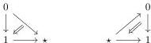
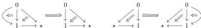

1.2. GRAY OPERATIONS

**Example 1.2.4.11.** The $(0, \omega)$-categories $\mathbf{D}_1 \star 1$ and $1 \stackrel{\text{co}}{\star} \mathbf{D}_1$ correspond respectively to the polygraphs:

The $(0, \omega)$-categories $\mathbf{D}_2 \star 1$ and $1 \stackrel{\text{co}}{\star} \mathbf{D}_2$ correspond respectively to the polygraphs:

**Proposition 1.2.4.12.** *Let $C$ be an $(0, \omega)$-category with an unitary and loop free basis. The canonical comparison*

$$(\lambda C) \star 1 \rightarrow \lambda(C \star 1)$$

*is an equivalence.*

*Let $K$ be an augmented directed complex with a loop free and unitary basis. The canonical comparisons*

$$(\nu K) \star 1 \rightarrow \nu(K \star 1)$$

*is an equivalence.*

*Proof.* The first assertion directly follows from the fact $\lambda$ commutes with colimits. For the second one, we can easily check that all the morphisms appearing in the squares (1.2.3.6) are quasi-rigid. The results then follow from an application of theorem 1.2.1.26. $\square$

The following theorems express the link between the Gray operations and the suspension. They will play a fundamental role in the rest of this work.

**Theorem 1.2.4.13.** *Let $C$ be an $(0, \omega)$-category. There is a natural identification between $[C, 1] \otimes [1]$ and the colimit of the following diagram*

$$[1] \vee [C, 1] \longleftarrow [C \otimes \{0\}, 1] \longrightarrow [C \otimes [1], 1] \longleftarrow [C \otimes \{1\}, 1] \longrightarrow [C, 1] \vee [1]$$

*Proof.* As all these functors preserve colimits, it is sufficient to construct the comparison when $C$ is a globular sum, and to show that it is an equivalence when $C$ is a globe. As globular sums have atomic and loop free bases, the comparison is induced by proposition 1.2.3.16. Using the explicit description of the $(0, \omega)$-category $\mathbf{D}_n \otimes [1]$ given in definition 1.2.4.6, it is straightforward to see that it induces an equivalence on globes. $\square$

**Theorem 1.2.4.14.** *There is a natural identification between $1 \stackrel{\text{co}}{\star} [C, 1]$ and the colimit of the following diagram*

$$[1] \vee [C, 1] \longleftarrow [C, 1] \longrightarrow [C \star 1, 1]$$

*There is a natural identification between $[C, 1] \star 1$ and the colimit of the following diagram*

$$[1 \stackrel{\text{co}}{\star} C, 1] \longleftarrow [C, 1] \longrightarrow [C, 1] \vee [1]$$

*There is a natural identification between $1 \star [C, 1]$ and the colimit of the following diagram*

$$[1 \star C, 1] \longleftarrow [C, 1] \longrightarrow [1] \vee [C, 1]$$

49