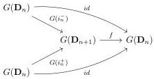

CHAPTER 1. (0,ω)-CATEGORIES AND PRESHEAVES ON Θ

Proof. This directly follows from the definition of these operations, from theorem 1.2.4.13 and from proposition 1.2.4.10. □

We are now willing to show the following theorem:

Theorem 1.2.4.15. Let F be an endofunctor of (0,ω)-cat such that the induced functor (0,ω)-cat → (0,ω)-cat_{F(0)/} is colimit preserving and ψ an invertible natural transformation between F(D_n) and G(D_n) where G is either the Gray cylinder, the Gray cone, the Gray o-cone, the Gray op-cone or an iterated suspension.

Then, the natural transformation ψ can be uniquely extended to an natural transformation between F and G. Moreover, this natural transformation is unique.

The previous theorem implies that the equations given in theorem 1.2.4.13 and 1.2.4.14 characterize respectively the Gray cylinder, the Gray cone, the Gray o-cone and the Gray op-cone.

Lemma 1.2.4.16. A sub category Θ' of Θ, stable by colimit is equal to Θ iff

(1) for any integer n and α ∈ {−,+1}, i_n^α : D_n → D_{n+1} belongs to Θ'.
(2) For any integer n, the unit I_n : D_{n+1} → D_n belongs to Θ'.
(3) For any pair of integers k < n, the composition ∇_{k,n} : D_n → D_n ∐_k D_n belongs to Θ'.

Proof. Suppose that Θ' fulfills these conditions. As globular morphisms are compositions of pushouts along morphisms of shape i_n^α, they belong to Θ'. As algebraic morphisms are compositions of colimits of morphism of shape ∇_{k,n} or I_n, they belong to Θ'. The result then follows from proposition 1.1.2.13 that states that every morphism factors as an algebraic morphism followed by a globular morphism. □

Lemma 1.2.4.17. Let n be an integer, and G be either the Gray cylinder, the Gray cone, the Gray o-cone, the Gray op-cone or an iterated suspension, and suppose given a square

Then, the morphism f is G(I_n).

Proof. As the proof for any possibilities of G are similar, we will show only the case G := _ ⊗ [1]. As for any integer n, D_n ⊗ [1] admits a loop free and atomic basis, we can then show the desired assertion after applying the functor λ. Remark first that the assumption implies that ∂f((e_{n+1} ⊗ {α}) = 0, and so f((e_{n+1} ⊗ {α}) = 0. We also have f(e_{n+1} ⊗ [1]) = 0 as λ(D_n ⊗ [1])_{n+2} = 0. This implies that f is equal to λ(G(I_n)). □

50