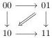
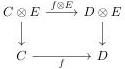
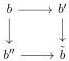

1.2. GRAY OPERATIONS

Proof. We denote by $P$ the colimit of this diagram. Remark that $\mathbf{F}P$ is the $(0, \omega)$-category generated by the diagram

and we then have $\mathbf{F}P \cong [1] \otimes [1]$. To conclude the proof, we have to show that $P$ is a $(0, \omega)$-category, i.e. that it has the unique right lifting property against W.

Let $f : [\mathbf{a}, n] \to P$ (resp. $f : \mathrm{Sp}_{[\mathbf{a}, n]} \to p$) be a morphism. If there exists an integer $i < n$ such that $f(i) = 00$ and $f(i + 1) = 11$, then $f$ uniquely factors through $[[1], 1] \to P$. If there exists an integer $i$ such that $f(i) = 10$, then $f$ uniquely factors through the left inclusion $[2] \to P$. If there exists an integer $i$ such that $f(i) = 01$, then $f$ uniquely factors through the right inclusion $[2] \to P$. If none of these conditions is satisfied, then $f$ factors through 00 or 11.

As $[2]$ and $[[1], 1]$ are $(0, \omega)$-categories, they have the unique right lifting property against W, and so has $P$. $\square$

Lemma 1.2.5.5. Let $C, D, E$ be three $(0, \omega)$-categories with loop-free and atomic bases. Let $f : C \to D$ be a morphism such that $f$ sends every generator of $C$ to a cell which is not a unit. The following square is then cartesian:

Proof. We can show this result at the level of the corresponding augmented directed complex, where it is an easy computation. $\square$

Lemma 1.2.5.6. Let $(a)_{i \leq n}$ be a sequence of elements of $\Theta$. There exists a diagram $F : I \to \Theta^+$ such that the presheaf $a_0 \times \ldots \times a_n$ is the colimit of $F$.

Proof. Let $I$ be the full subcategory of $\Theta_{/a_0 \times \ldots \times a_n}$ whose objects are $n$-tuples of morphisms $(j_i : b \to a_i)_{i \leq n}$ such that there exists no morphism $b \to b'$ in $\Theta^-$ that factors all the $j_i$. Morphisms are the ones such that $b \to b'$ in $\Theta^+$.

Let $(j_i : b \to a_i)_{i \leq n}$ be any element of $\Theta_{/a_0 \times \ldots \times a_n}$. We will show that there exists a unique degenerate morphism $g : b \to b'$ that factors the morphisms $b \to a_i$ for all $i < n$, and such that the induced family of morphisms $\{b' \to a_i\}_{i < n}$ is an element of $I$. It will implies that $g$ is an initial object of the category $I_{(j_i)_{i \leq n}/}$, and then that $\alpha : I \to \Theta_{/a_0 \times \ldots \times a_n}$ is final, which will concludes the proof.

As any infinite sequence of degenerate morphisms is constant at some point, the existence is immediate. Suppose given two morphisms $b \to b'$, $b \to b''$ fulfilling the previous condition. By proposition 1.1.2.10, the category $\Theta$ is Reedy elegant and the proposition 3.8 of [BR13] then implies that there exists a globular sum $\tilde{b}$ and two degenerate morphisms $b' \to \tilde{b}$ and $b'' \to \tilde{b}$ such that the induced square

is cocartesian. The universal property of pushout implies that $b \to \tilde{b}$ also fulfills the previous condition. By definition of $b'$ and $b''$, this implies that they are equal to $\tilde{b}$, and this shows the uniqueness. $\square$

53