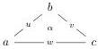

CONTENTS

Given a stratified simplicial set $(K, tK)$, we would like to view it as a "sort of $\omega$-category". The 0-simplices correspond to objects, the 1-simplices

$$a - u - b$$

to 1-cells between $a$ and $b$, the 2-simplices

to 2-cells with source $w$ and target the composite of $u$ and $v$, and more generally the $n$-simplices to $n$-cells whose source is a composition of odd faces and target a composition of even faces. Marked $n$-simplices are those whose corresponding $n$-cell is weakly invertible.

For this interpretation to be viable, some conditions on $(K, tK)$ must be imposed so that these "cells" "compose", and so that the marked simplices (i.e., "weakly invertible cells") satisfy a (2 out of 6)-type axiom$^1$. These conditions have been formalized by Verity in [Ver08c]. A stratified simplicial set satisfying them is called a *complicial set*.$^2$

In practice, these conditions are expressed using lifting properties. As these liftings are non-unique, compositions are not unique either. However, it can be shown that they are unique up to homotopy. Thus, a complicial set resembles a "weak $\omega$-category". Similarly, an $n$-complicial set (i.e., a complicial set where all simplices of dimension strictly greater than $n$ are marked) is a kind of "weak $n$-category".

It was therefore conjectured ([Str87], [Ver17], [BSP21]) that that for any $n \in \mathbb{N} \cup \{\omega\}$, the Verity model structure for $n$-complicial sets (whose fibrants-cofibrants are exactly $n$-complicial sets) was a model for $(\infty, n)$-categories.

The case $n = 1$ is an easy exercise, and the case $n = 2$ was proven by Gagna, Harpaz, and Lanari in [GHL22]. The goal of this text is to provide a positive answer to this conjecture in the general case, i.e. for any $n \in \mathbb{N} \cup \{\omega\}$.

## Summary of results

**Chapter 1.** The first section is devoted to the definition of $(0, \omega)$-categories and of the category $\Theta$ of Joyal. We also show that the category $\Theta$ presents the category of $(0, \omega)$-categories, and we also exhibit an other presentation of this category (corollary 1.1.3.4).

The second section begins with a review of Steiner theory, which is an extremely useful tool for providing concise and computational descriptions of $(0, \omega)$-categories. Following Ara and Maltsiniotis, we employ this theory to define the Gray tensor product, denoted by $\otimes$, in $(0, \omega)$-categories. We then introduce the Gray operations, starting with the Gray cylinder $_\otimes [1]$ which is the Gray tensor product with the directed interval $[1] := 0 \to 1$. Then, we have the *Gray cone*, the *Gray $\circ$-cone* and the *Gray*

$^1$Given a category $C$, a class $W$ of morphisms of $C$ satisfies (2 out of 6) if for any triple of morphisms $f$, $g$, and $h$ such that $fg$ and $gh$ are in $W$, then $f$, $g$, $h$, and $fgh$ are in $W$.

$^2$This notion is sometimes called a *saturated complicial set*.

6