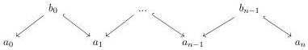

2.1. PRELIMINARIES

Proposition 2.1.1.1. Suppose given a square

such that the two horizontal morphisms are weak equivalences. Then this square is homotopy cocartesian.

Proof. This is [Cis19, proposition 2.3.26].

Proposition 2.1.1.2. Suppose given a cocartesian square

where the left vertical morphism is a cofibration. Then this square is homotopy cocartesian.

Proof. This is [Cis19, corollary 2.3.28].

Proposition 2.1.1.3. Weak equivalences are stable by pushout along cofibrations.

Proof. This is [Hir03, proposition 13.1.2].

Proposition 2.1.1.4. Let $F : \alpha \to C$ be a diagram indexed by an ordinal. The transfinite composition $\operatorname{colim}_{\alpha} F$ is the homotopy colimit of the diagram $F$.

Proof. This is [Cis19, proposition 2.3.13].

Proposition 2.1.1.5. Suppose given a diagram

where all morphisms labelled by $\hookrightarrow$ are cofibrations. The colimit of this diagram is also the homotopy colimit of this diagram.

Proof. Let $I_n$ be the category indexing the previous diagram. We denote by $i_0, j_0, \ldots, i_{n-1}, j_{n-1}, i_n$ it's objects. The projective model structure on $\operatorname{Fun}(I_n, C)$ is given by functor $G$ such that for any $k < n$, $F(j_k) \to F(i_k)$, $F(j_k) \to F(i_{k+1})$ are monomorphisms, and such that for any $0 < k < n$, $F(j_k) \coprod F(j_{k+1}) \to F(i_k)$ is a monomorphism. Remark that such presheaves verify the condition given in the statement of the proposition.

We will show on induction on $n$ that a natural transformation $\psi$ between two diagrams $F, G : I_n \to C$ that fulfills the desired condition induces a weak equivalence between their colimits. As we can always chose $F$ to be the cofibrant replacement of $G$ in the projective model structure on $\operatorname{Fun}(I_n, C)$, it will imply the desired result.

The case $n = 1$ is proposition 2.1.1.2. Suppose now the result is true at the stage $(n - 1)$ and let $\psi$ be a weakly invertible natural transformation between two diagram $F, G : I_n \to C$ that fulfills the desired

63