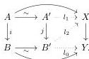
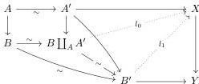

2.1. PRELIMINARIES

*Proof.* Let $U$ be the class of morphisms in $A$ that are sent to weak equivalences by $F$. This class is obviously stable by two out of three, retracts and contains weak equivalences. As the model structure on $C$ is combinatorial and left proper, it is saturated. The class $U$ then includes all morphisms of shape $i \times f$ for $i$ a cofibration and $f \in S$, which implies that $F$ can be lifted to $A_S$. $\square$

**Definition 2.1.1.12.** Let $i : A \to B$ and $i' : A' \to B'$ be two cofibrations. A *zigzag of acyclic cofibration* between $i$ and $i'$, denoted $i \rightsquigarrow i'$ is a zigzag in the category of arrows such that all the horizontal maps are acyclic cofibrations, and all the vertical maps are cofibrations.

**Lemma 2.1.1.13.** *Let $i$ and $j$ be two cofibrations, and $f : X \to Y$ a fibration between fibrant objects. Suppose that we have a morphism in the category of arrows $i \to j$ which is pointwise an acyclic cofibration. Then, if $j$ has the left lifting property against $f$, so has $i$.*

*Proof.* We consider a diagram of the following shape:

We construct, one after the other, the lifting $l_0$, $l_1$ and $l_2$. $\square$

**Lemma 2.1.1.14.** *Let $i$ and $j$ be two cofibrations, and $f : X \to Y$ a fibration between fibrant objects. Suppose that we have a morphism in the category of arrows $i \to j$ which is pointwise an acyclic cofibration. Then, if $i$ has the right lifting property against $f$, so has $j$.*

*Proof.* We consider a diagram of the following shape:

We construct, one after the other, the lifting $l_0$, $l_1$. $\square$

**Proposition 2.1.1.15.** *Let $f$ be a fibration between fibrant objects and $i$ and $j$ two cofibrations such that there exists a zigzag of acyclic cofibrations $i \rightsquigarrow j$. Then $f$ has the right lifting property against $i$ if and only if it has the right lifting property against $j$.*

*Proof.* This is a direct consequence of the last two lemmas. $\square$

## 2.1.2 Marked and stratified presheaves

**Definition 2.1.2.1.** Let $B$ be an elegant Reedy category and $M$ a subset of the set of objects of $B$. A $M$-*stratified presheaf on $B$*, or just a *stratified presheaf on $B$* when the subset $M$ will be non-ambiguous, is a pair $(X, tX)$ where $X$ is a presheaf on $B$ and $tX := \coprod_{a \in M} tX_a$ is the disjoint union of sets, such that

65