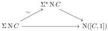

CHAPTER 2. STUDY OF COMPLICIAL SETS

natural in $n$.

We can extend the functor $O_{-}: \Delta \to (0, \omega)$-cat to $t\Delta$ by defining

$$(O_{n})_{t} := \tau_{n-1}^{i}(O_{n}),$$

where $\tau_{n-1}^{i}$ denote the intelligent truncation defined in construction 2.2.1.15.

By extention by colimit, this induces a functor

$$\mathrm{R}: \mathrm{tPsh}(\Delta) \to (0, \omega)\text{-cat}.$$

As explained in example 11 of [Ver06], R preserves the Gray tensor product, and so also the suspension, the wedge, the Gray cone and the Gray o-cone. Moreover, [Ver08a, Theorem 249] states that this functor sends complicial horn inclusions and complicial thinness extensions to isomorphisms. It obviously also sends saturation extensions to isomorphisms. This functor then sends every weak equivalences to isomorphisms, and then lifts to a colimit preserving functor $\mathrm{R}: \mathrm{mPsh}(\Delta) \to (0, \omega)$-cat and induces an adjoint pair:

$$\mathrm{R}: \mathrm{mPsh}(\Delta) \xrightarrow{\quad} (0, \omega)\text{-cat}: \mathrm{N}$$

We now recall two fundamental results of strictification:

**Theorem 2.2.3.2** (Gagna, Ozornova, Rovelli). *Let $n$ be an integer. The canonical morphism*

$$[n] \to \mathrm{N}(\mathrm{R}([n]))$$

*is an acyclic cofibration.*

*Proof.* This is [GOR21, corollary 5.4].

**Theorem 2.2.3.3** (Ozornova, Rovelli). *Let $C$ be an $(0, \omega)$-category. The canonical morphism*

$$\Sigma \mathrm{N} C \to \mathrm{N}([C, 1])$$

*is an acyclic cofibration.*

*Proof.* The morphism (2.2.2.16) provides a weak equivalence $\Sigma \mathrm{N} C \to \Sigma^{*} \mathrm{N} C$. As $R$ preserves the Gray tensor product and the Gray cone, it sends this morphism to an isomorphism. We then have a commutative triangle

The theorem 3.22 of [OR22] stipulates that $\Sigma^{*} \mathrm{N} C \to \mathrm{N}([C, 1])$ is a weak equivalence, which concludes the proof.

**Definition 2.2.3.4.** We define the *Street endofunctor* $i_{str}$ to be the colimit preserving functor defined on representables by:

$$i_{str}([n]) := \mathrm{N}(\mathrm{R}([n])) \quad \text{and} \quad i_{str}([n]_{t}) := \tau_{n-1}^{i}(i_{str}([n]))$$

**Proposition 2.2.3.5.** *The functor $i_{srt}$ is left Quillen and the natural transformation*

$$id \to i_{srt}$$

*is weakly invertible.*

78