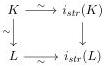
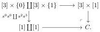
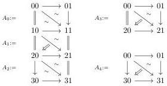

2.3. SUSPENSION AND GRAY OPERATIONS

Proof. As noticed earlier, for any integer $n$, the map $[n] \to i_{srt}([n])$ is a weak equivalence. We recall that the intelligent truncation functor $\tau_{n-1}^i : \mathrm{mPsh}(\Delta) \to \mathrm{mPsh}(\Delta)$ is a left Quillen functor, and so preserves weak equivalences between cofibrant objects. The morphism $[n]_t \to i_{str}([n]_t)$ is then a weak equivalence. The set of objects $X$ such that the morphism $X \to i_{srt}X$ is a weak equivalence is closed by homotopy colimits and includes all representables. As $i_{srt}$ preserves monomorphisms, it then consists of all marked simplicial sets. Now let $K \to L$ be an acyclic cofibration. We have a commutative square:

By two out of three, $i_{str}(K) \to i_{str}(L)$ is then an acyclic cofibration. The functor $i_{srt}$ is then left Quillen.

## 2.3 Suspension and Gray operations

### 2.3.1 Formula for the Gray cylinder

The aim of this subsection is to demonstrate the following theorem, which is the analogue in stratified simplicial sets of the theorem 1.2.4.13.

**Theorem 2.3.1.1.** *There is a zigzag of acyclic cofibrations, natural in $X$, between the colimit of the diagram*

$$[1] \forall \Sigma X \xleftarrow{\nabla} \Sigma(X \otimes \{0\}) \hookrightarrow \Sigma(X \otimes [1]) \leftarrow \Sigma(X \otimes \{1\}) \xrightarrow{\nabla} \Sigma X \forall [1]$$

and $(\Sigma X) \otimes [1]$.

**Construction 2.3.1.2.** Let $C$ be the following colimit:

We define several marked simplicial sets whose underlying simplicial sets are sub objects of C:

where arrows labeled by $=$ are degenerate and simplices labeled by $\sim$ are thin.

Let $B_0$ be the sub object corresponding to the image of $[0, 1, 2] \times [0, 1]$ where the marking includes all cells of dimension $\le 2$, except $[10, 20, 21]$ and $[00, 20, 21]$.

79