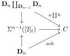
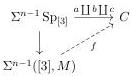

2.4. GLOBULAR EQUIVALENCES

From now on, and until the end of this section, we fix a complicial set $C$. All considered cells are cells of $C$.

**Definition 2.4.1.2.** Let $n$ be a non null integer, and $a, b$ two $n$-cells. Cells $a$ and $b$ are *parallel* if they share the same source and the same target. They are *composable* if the source of $a$ is the target of $b$.

Let $a$ and $b$ be two parallel cells. The cell $a$ is *equivalent* to the cell $b$ if there exists a marked $(n + 1)$-cell $d : a \to b$, or equivalently, if there exists a homotopy $\mathbf{D}_n \times [1]_t$ between $a$ and $b$, and constant on $\partial \mathbf{D}_n \times [1]_t$. This relation is denoted by $\sim$.

**Lemma 2.4.1.3.** *The relation $\sim$ is reflexive, symmetric and transitive.*

*Proof.* This comes from usual properties of fibrant objects.

**Lemma 2.4.1.4.** *Let $a, b$ be two equivalent cells. If $a$ is marked, so is $b$.*

*Proof.* As $\{0\} \to [1]_t$ is a weak equivalence, so is $\mathbf{D}_n \times [1]_t \cup (\mathbf{D}_n)_t \times \{0\} \to (\mathbf{D}_n)_t \times [1]_t$. As $C$ is fibrant, this directly implies the result.

**Construction 2.4.1.5.** Let $a, b$ be two composable $n$-cells. A composition of $a$ and $b$ is a $n$-cell $a \circ b$ that fits in a diagram:

As $C$ is a fibrant object, if $(a \circ b)'$ is any other composition, $(a \circ b)' \sim a \circ b$.

**Lemma 2.4.1.6.** *Let $a, b, c$ be three composable cells. There exists compositions such that $(a \circ b) \circ c = a \circ (b \circ c)$.*

*Proof.* Let $M$ be the marking on $[3]$ that includes all simplices of dimension superior or equal to 2. We define $\mathrm{Sp}_{[3]}$ as the simplicial set $[1] \coprod_{[0]} [1] \coprod_{[0]} [1]$. Remark that the cofibration $\mathrm{Sp}_{[3]} \to ([3], M)$ is acyclic. We then have a lift $f$ in the following diagram

The morphism $f$ provides all the desired compositions.

**Definition 2.4.1.7.** We define the category $\pi_0(C)$ whose objects are 0-cells $x : s \to t$, and edges between $x, y : s \to t$ are equivalence classes of the set of 1-cells $f : x \to y$ quotiented by the relation $\sim$. The composition is given by construction 2.4.1.5 which is associative according to lemma 2.4.1.6.

Let $n > 0$ be an integer, and $s, t$ two parallel $(n - 1)$-cells. We define the category $\pi_n(s, t, C)$ whose objects are $n$-cells $x : s \to t$, and edges between $x, y : s \to t$ are equivalence classes of the set of $(n + 1)$-cells $f : x \to y$ quotiented by the relation $\sim$. The composition is given by construction 2.4.1.5 which is associative according to lemma 2.4.1.6.

85