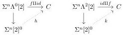
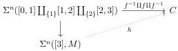
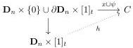
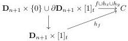
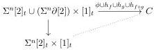

CHAPTER 2. STUDY OF COMPLICIAL SETS

Proposition 2.4.1.8. Let $x, y : s \to t$ be two parallel $n$-cells, and $f : x \to y$ a $n + 1$-cell. The cell $f$ is marked if and only if $[f] : x \to y$ is an isomorphism in $\pi_n(s, t, C)$.

Proof. Suppose first that $f$ is marked. There are liftings in the following diagrams:

Let $g : y \to z$ be the restriction of $h$ to $\Sigma^n[1, 2]$ and $l : y \to z$ be the restriction of $k$ to $\Sigma^n[0, 1]$. We then have $[f][g] = id$, and $[h][f] = id$, and $[f]$ is then an isomorphism.

For the other direction, suppose that $[f]$ is an isomorphism. Let $M$ be the marking on $[3]$ that includes all simplices of dimension superior or equal to 2. As $\mathrm{Sp}_{[3]} \to ([3], M)$ is a weak equivalence, there is a lifting in the following diagram:

Now $h(\Sigma^n[0, 3])$ and $h(\Sigma^n[0, 2])$ are respectively compositions of $(f, f^{-1})$ and $(f^{-1}, f)$. Hypotheses imply that these compositions are equivalent to identities, and so are marked. The morphism then lifts to $\Sigma^n[3]^{eq}$. The object $C$ being fibrant, $h$ lifts to $\Sigma^n[3]^2$, and $f$ is then marked.

Lemma 2.4.1.9. Let $s, t$ and $s', t'$ be two pairs of parallel cells, and $\psi : \partial\mathbf{D}_n \times [1]_t \to C$ a homotopy between $s \cup t : \partial\mathbf{D}_n \to C$ and $s' \cup t' : \partial\mathbf{D}_n \to C$. Then

$$\pi_n(s, t, C) \cong \pi_n(s', t', C)$$

Proof. For each $x : s \to t$, there exists a lifting $h_x$ in the following diagram:

and we define $F(x)$ as the restriction of $h_x$ to $\mathbf{D}_n \times \{1\}$. For a $(n + 1)$-cell $f : x \to y$, there exists a lifting $h_f$ in the following diagram:

and we define $F(f)$ as the restriction of $h_f$ to $\mathbf{D}_{n+1} \times \{1\}$. Furthermore, the unicity up to homotopy of lifting implies that $[F(f)]$ is independent of the choice of the lifting, and that $f \sim g$ implies $[F(f)] = [F(g)]$. If $g : y \to z$ is an other morphism, and $\psi : \Sigma^n[2]_t \to C$ corresponds to the composition of $f$ and $g$, there is a lift in the following diagram:

86