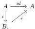
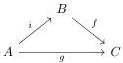

CHAPTER 2. STUDY OF COMPLICIAL SETS

Lemma 2.4.2.2. Let \(\alpha \in \{-, +\}\). The morphism \(i_{n+1}^{\alpha}: \mathbf{D}_n \to (\mathbf{D}_{n+1})_t\) is an acyclic cofibration.

Proof. We have a pushout diagram

\[
\begin{array}{c} \mathbf {D} _ {n} \times \{\alpha \} \cup \partial \mathbf {D} _ {n} \times [ 1 ] _ {t} \xrightarrow {i d \cup \partial \times s ^ {\theta}} \mathbf {D} _ {n} \times \{\alpha \} \\ \Big \downarrow \qquad \qquad \qquad \qquad \qquad \qquad \qquad \qquad \qquad \qquad \qquad \qquad \qquad \qquad \qquad \qquad \qquad \qquad \qquad \qquad \qquad \qquad \qquad \qquad \qquad \qquad \qquad \qquad \qquad \qquad \qquad \qquad \qquad \qquad \\ \mathbf {D} _ {n} \times [ 1 ] _ {t} \xrightarrow {} (\mathbf {D} _ {n}) _ {t} \end{array}
\]

The left hand morphism being an acyclic cofibration, this concludes the proof.

Lemma 2.4.2.3. Acyclic cofibrations between complicial sets are D-equivalences.

Proof. Let \( i: A \to B \) be an acyclic cofibration. The morphism \( i \) admits a retraction \( r: B \to A \):

and a homotopy \(\psi\) between \(id_B\) and \(ir\) which is constant on the image of \(i\), obtained as the lift in the following diagram:

\[
\begin{array}{c} B \times \{0 \} \coprod_ {A \times \{0 \}} A \times [ 1 ] _ {t} \longrightarrow B \\ \Big \downarrow \qquad \qquad \qquad \qquad \qquad \qquad \qquad \qquad \qquad \qquad \qquad \qquad \qquad \qquad \qquad \qquad \qquad \qquad \qquad \qquad \qquad \qquad \qquad \qquad \qquad \qquad \qquad \qquad \qquad \qquad \qquad \qquad \qquad \qquad \\ B \times [ 1 ] _ {t} \end{array}
\]

Let \( n > 0 \) be an integer, and \( s, t \) be two \( (n - 1) \)-cells of \( C \). The retraction implies that \( i_{!} \) is an injection on morphisms. For any \( n \)-cell \( y: i(s) \to i(t) \) in \( B \), the homotopy \( \psi \) induces a marked cell \( y \to ir(y) \) which corresponds to an isomorphism in \( \pi_n(is, it, B) \) according to proposition 2.4.1.8. The functor \( i_{!} \) is then essentially surjective. For any \( (n + 1) \)-cell \( f: i(x) \to i(y) \), the homotopy \( \psi \) induces an equivalence \( [ir(f)] \sim [f] \). The morphism \( i_{!} \) is a surjection on morphisms. All put together, \( i_{!} \) is fully faithfull and essentially surjective, and is then an equivalence. We proceed similarly to show that \( i_{!}: \pi_0(A) \to \pi_0(B) \) is an equivalence.

Lemma 2.4.2.4. Suppose given a commutative triangle between complicial sets

If \(i\) is an acyclic cofibration, and \(g\) is a \(\mathbf{D}\)-equivalence, then \(f\) is a \(\mathbf{D}\)-equivalence.

Proof. Let \( s, t \) be any pair of parallel arrows in \( B \). There exists a pair of parallel arrows \( s', t' \) in \( A \) such that \( s \cup t \) and \( is' \cup it' \) correspond to the same element in \( [\partial \mathbf{D}_n, B] \). We then have a diagram:

\[
\begin{array}{c} \pi (s, t, B) \longrightarrow \pi (f s, f t, C) \\ \Big \downarrow^ {\sim} \qquad \qquad \qquad \qquad \qquad \qquad \Big \downarrow^ {\sim} \\ \pi (s, t, B) \xrightarrow {\sim} \pi (i s, i t, B) \longrightarrow \pi (g s, g t, C). \\ \sim \end{array}
\]

where arrows labeled by \(\sim\) are isomorphisms according to lemmas 2.4.1.9 and 2.4.2.3. By two out of three, this shows that \(\pi(s,t,B) \to \pi(fs,ft,C)\) is an isomorphism, and \(f\) is then a \(\mathbf{D}\) equivalence.

88