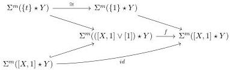

CHAPTER 2. STUDY OF COMPLICIAL SETS

Suppose the result true when the sum of dimensions of $x$ and $y$ is $(k - 1)$. Let $x, y$ be two cells such that $|x| + |y| = k$. Case $|x| = 0$. The commutativity of $f$ with $\partial$ and the induction hypothesis imply that

$$\begin{array}{l} \partial r_{x, y} = f(\partial([x, 1] \star y)) - \partial([x, 1] \star y) \\ = \{t\} \star y - \{0\} \star y + f([x, 1] \star \partial y) - \{1\} \star y + \{0\} \star y - [x, 1] \star \partial y \\ = \{t\} \star y - \{1\} \star y + [1] \star \partial y \end{array}$$

and $r_{x,y}$ is then equal to $[1] \star y$. Case $|x| > 0$. The commutativity of $f$ with $\partial$ implies that

$$\partial r_{x, y} = 0$$

and $r_{x,y}$ is then equal to 0.

Lemma 2.4.4.4. Let $m$ be an integer and $X$ and $Y$ be two $(0, \omega)$-categories admitting a loop free and atomic basis. We denote by 0, 1 and $t$ the three points of $\Sigma X \vee [1]$. Let

$$f: \Sigma^m([X, 1] \star Y) \to \Sigma^m(([X, 1] \vee [1]) \star Y)$$

be a morphism fitting in the following diagram:

Then $f$ is the morphism induced by the retraction $[X, 1] \vee [1] \to [X, 1]$.

Proof. The proof is an easy computation using Steiner theory, similar to the one done in lemma 2.4.4.3, and left to the reader.

Definition 2.4.4.5. Let $C$ be the subcategory of marked simplicial sets whose

- objects are the marked simplicial sets $X$ such that $\mathrm{R}(X)$ has no non-trivial automorphisms, and such that there exists a (necessary unique) isomorphism

$$\phi_X: \mathrm{R}(iX) \to \mathrm{R}(X),$$

- morphisms are the maps $f: X \to Y$ making the induced diagram

$$\begin{array}{c} \mathrm{R}(i(X)) \xrightarrow{\phi_X} \mathrm{R}(X) \\ \mathrm{R}(i(f)) \downarrow \qquad \qquad \qquad \qquad \downarrow \mathrm{R}(f) \\ \mathrm{R}(i(Y)) \xrightarrow{\phi_Y} \mathrm{R}(Y) \end{array}$$

commutative.

We recall that the functor $R: \mathrm{mPsh}(\Delta) \to (0, \omega)$-cat is defined in construction 2.2.3.1.

94