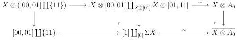
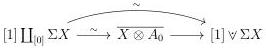
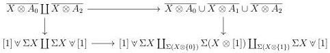

CHAPTER 2. STUDY OF THE COMPLICIAL MODEL

Lemma 2.3.1.8. The morphisms \(\overline{X\otimes A_0}\to [1]\vee \Sigma X\) and \(\overline{X\otimes A_2}\to \Sigma X\vee [1]\), induced by the morphism \(A_0\to [00,01,11]_t\) and \(A_{2}\rightarrow [20,30,31]_{t}\), are acyclic cofibrations.

Proof. We have cocartesian squares

That shows that \([1] \coprod_{[0]} \Sigma X \to \overline{X \otimes A_0}\) is an acyclic cofibration. We then have a commutative diagram:

and by two out of three, this shows that  \( \overline{X\otimes A_{0}}\to[1]\vee\Sigma X \)  is an acyclic cofibration. We proceed similarly for the second morphism. ☐

Lemma 2.3.1.9. Marked simplicial sets \(\overline{X\otimes A_1}\) and \(\overline{X\otimes A_4}\) are respectively equal to \(\Sigma (X\otimes [1])\) and \((\Sigma X)\otimes [1]\).

Proof. This is true by the definition of these objects.

Proof of theorem 2.3.1.1. According to lemma 2.3.1.9 we have a cocartesian square

The left vertical morphism is a weak equivalence according to lemma 2.3.1.8, and the horizontal morphisms are cofibrations. By left properness, the right vertical morphism is a weak equivalence. Combined with lemmas 2.3.1.7 and 2.3.1.9, this provides a zigzag of weak equivalences between \([1] \vee \Sigma X \coprod_{\Sigma(X \otimes \{0\})} \Sigma(X \otimes [1]) \coprod_{\Sigma(X \otimes \{1\})} \Sigma X \vee [1]\) and \((\Sigma X) \otimes [1]\).

#### 2.3.2 Formulas for the Gray cone and the Gray o-cone

Theorem 2.3.2.1. There is a zigzag of acyclic cofibrations, natural in \( X \), between the colimit of the diagram

\[
\Sigma X \vee [ 1 ] \leftarrow \Sigma X \rightarrow \Sigma ([ 0 ] ^ {\infty} \star X)
\]

90