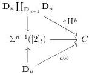
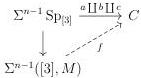
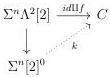

CHAPTER 2. STUDY OF THE COMPLICIAL MODEL

Construction 2.4.1.5. Let \( a, b \) be two composable \( n \)-cells. A composition of \( a \) and \( b \) is a \( n \)-cell \( a \circ b \) that fits in a diagram:

As \(C\) is a fibrant object, if \((a\circ b)'\) is any other composition, \((a\circ b)'\sim a\circ b\).

Lemma 2.4.1.6. Let \( a, b, c \) be three composable cells. There exists compositions such that \( (a \circ b) \circ c = a \circ (b \circ c) \).

Proof. Let \( M \) be the marking on [3] that includes all simplices of dimension superior or equal to 2. We define \( \mathrm{Sp}_{[3]} \) as the simplicial set \( [1] \coprod_{[0]} [1] \coprod_{[0]} [1] \). Remark that the cofibration \( \mathrm{Sp}_{[3]} \to ([3], M) \) is acyclic. We then have a lift \( f \) in the following diagram

The morphism \( f \) provides all the desired compositions.

Definition 2.4.1.7. We define the category \(\pi_0(C)\) whose objects are 0-cells \(x: s \to t\), and edges between \(x, y: s \to t\) are equivalence classes of the set of 1-cells \(f: x \to y\) quotiented by the relation \(\sim\). The composition is given by construction 2.4.1.5 which is associative according to lemma 2.4.1.6.

Let n > 0 be an integer, and s, t two parallel  \( (n - 1) \) -cells. We define the category  \( \pi_{n}(s, t, C) \)  whose objects are n-cells  \( x : s \to t \) , and edges between  \( x, y : s \to t \)  are equivalence classes of the set of  \( (n + 1) \) -cells  \( f : x \to y \)  quotiented by the relation  \( \sim \) . The composition is given by construction 2.4.1.5 which is associative according to lemma 2.4.1.6.

Proposition 2.4.1.8. Let \( x, y: s \to t \) be two parallel \( n \)-cells, and \( f: x \to y \) a \( n + 1 \)-cell. The cell \( f \) is thin if and only if \( [f]: x \to y \) is an isomorphism in \( \pi_n(s, t, C) \).

Proof. Suppose first that \( f \) is thin. There are liftings in the following diagrams:

94