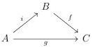

CHAPTER 2. STUDY OF THE COMPLICIAL MODEL

a thin cell $y \to ir(y)$ which corresponds to an isomorphism in $\pi_n(is, it, B)$ according to proposition 2.4.1.8. The functor $i_!$ is then essentially surjective. For any $(n + 1)$-cell $f : i(x) \to i(y)$, the homotopy $\psi$ induces an equivalence $[ir(f)] \sim [f]$. The morphism $i_!$ is a surjection on morphisms. All put together, $i_!$ is fully faithfull and essentially surjective, and is then an equivalence. We proceed similarly to show that $i_! : \pi_0(A) \to \pi_0(B)$ is an equivalence.

**Lemma 2.4.2.4.** *Suppose given a commutative triangle between complicial sets*

*If $i$ is an acyclic cofibration, and $g$ is a $\mathbf{D}$-equivalence, then $f$ is a $\mathbf{D}$-equivalence.*

*Proof.* Let $s, t$ be any pair of parallel arrows in $B$. There exists a pair of parallel arrows $s', t'$ in $A$ such that $s \cup t$ and $is' \cup it'$ correspond to the same element in $[\partial \mathbf{D}_n, B]$. We then have a diagram:

$$\begin{array}{c} \pi(s, t, B) \longrightarrow \pi(fs, ft, C) \\ \downarrow \sim \qquad \qquad \qquad \downarrow \sim \\ \pi(s, t, B) \xrightarrow{\sim} \pi(is, it, B) \longrightarrow \pi(gs, gt, C). \\ \sim \end{array}$$

where arrows labeled by $\sim$ are isomorphisms according to lemmas 2.4.1.9 and 2.4.2.3. By two out of three, this shows that $\pi(s, t, B) \to \pi(fs, ft, C)$ is an isomorphism, and $f$ is then a $\mathbf{D}$ equivalence.

**Proposition 2.4.2.5.** *Let $p : C \to D$ be a fibration between complicial sets. The morphism $p$ is a $\mathbf{D}$-trivial fibration if and only if it is a $\mathbf{D}$-equivalence.*

*Proof.* If $p$ is a $\mathbf{D}$-trivial fibration, it is obvious that it is a $\mathbf{D}$-equivalence. For the converse, suppose $p$ is a fibration and a $\mathbf{D}$-equivalence, and consider a diagram

$$\begin{array}{c} \partial \mathbf{D}_n \longrightarrow C \\ \downarrow \qquad \qquad \qquad \downarrow_p \\ \mathbf{D}_n \xrightarrow{x} D \end{array}$$

As $p$ is a $\mathbf{D}$-equivalence this implies that there exists a cell $\overline{x} : \mathbf{D}_n \to C$ together with a thin $(n + 1)$-cell $y : p(\overline{x}) \to y$. All this data corresponds to a diagram:

$$\begin{array}{c} \mathbf{D}_n \xrightarrow{\overline{x}} C \\ \delta_{n+1}^0 \downarrow \qquad \qquad \qquad \downarrow_p \\ (\mathbf{D}_{n+1})_t \xrightarrow{y} D \end{array}$$

98