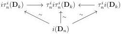

2.4. GLOBULAR EQUIVALENCES

#### 2.4.4 Weak characterization of the identity

For the rest of this section, we fix a left Quillen functor  \( i : \mathrm{mPsh}(\Delta) \to \mathrm{mPsh}(\Delta) \)  such that there exists a zigzag of weakly invertible natural transformations:

\[
i (\mathbf {D} _ {-}) \leftrightarrow \mathbf {D} _ {-}.
\]

Lemma 2.4.4.1. Let \( n \) be any integer, the following natural transformations are pointwise acyclic cofibrations:

\[
i \tau_ {n} ^ {i} \rightarrow \tau_ {n} ^ {i} i \tau_ {n} ^ {i} \gets \tau_ {n} ^ {i} i.
\]

Proof. These are natural transformations between left Quillen functors. The hypothesis implies that they induce weak equivalences on globes of dimension inferior or equal to n. Remark that for any k > n, as  \( i_{k-1}^{-}: D_{k-1} \to (D_k)_t \)  is an acyclic cofibration and  \( \tau_n^i \)  preserves them,  \( \tau_n^i D_{k-1} \to \tau_n^i D_k \)  is an acyclic cofibration. A direct induction implies that  \( D_n = \tau_n^i D_n \to \tau_n^i D_k \)  is an acyclic cofibration. We then have a commutative diagram:

where all morphisms labelled by  \( \sim \)  are weak equivalences.

By two out of three, this implies that theses natural transformations induce weak equivalences on all globes, and proposition 2.4.3.1 concludes the proof. \(\square\)

Proposition 2.4.4.2. There exists a zigzag of weakly invertible natural transformations

\[
i \leftrightarrow j
\]

where \(j\) is a left Quillen functor such that \(j([n]) = i([n])\) and \(j([n]_t) = \tau_{n-1}^i i([n])\), and such that the image of \([n] \to [n]_t\) by \(j\) is induced by the canonical morphism \(id \to \tau_{n-1}^i(id)\).

Proof. We define  \( \tilde{i} \)  (resp. j) to be the colimit preserving functor defined on representables by  \( \tilde{i}([n]) := i([n]) \)  and  \( \tilde{i} := ([n]_{t}) = \tau_{n-1}^{i} i([n]_{t}) \)  (resp.  \( j([n]) := i([n]) \)  and  \( j([n]_{t}) := \tau_{n-1}^{i} i([n]) \) ). We then have a zigzag of natural transformations

\[
i \stackrel {\sim} {\to} \tilde {i} \stackrel {\sim} {\leftarrow} j.
\]

that are pointwise acyclic cofibrations according to 2.4.4.1. This implies that both \(\tilde{i}\) and \(j\) are left Quillen functors.

103