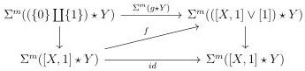

CHAPTER 2. STUDY OF THE COMPLICIAL MODEL

2.4.4.3. In the following lemmas, we use the Steiner theory recalled in section 1.2.1.

Lemma 2.4.4.4. Let m be an integer and X and Y be two  \( (0,\omega) \) -categories admitting a loop free and atomic basis. We denote by 0, 1 and t the three points of  \( \Sigma X \vee [1] \) . Let

\[
f: \Sigma^ {m} ([ X, 1 ] \star Y) \to \Sigma^ {m} (([ X, 1 ] \vee [ 1 ]) \star Y)
\]

be a morphism fitting in the following diagram:

where \( g \) sends 0 on 0, and sends 1 on \( t \) and the right vertical morphism induced by the retraction \( [X,1] \vee [1] \to [X,1] \).

Then \(f\) is \(\Sigma^{m}(\nabla \star Y)\).

Proof. All these categories admit loop free and atomic basis. We can then show this lemma in the category of augmented directed complexes. Furthermore, in this category, the suspension only makes an index shift, so we can assume without loss of generality that m = 0.

The commutativity of the diagram implies that

\[
f (0 \star x) = 0 \star x
\]

\[
f (1 \star x) = t \star x
\]

\[
f ([ x, 1 ] \star y) = [ x, 1 ] \star y + r _ {x, y}
\]

where \( r_{x,y} \) is a positive sum of elements of \( (B_{[1]\star Y})_{|x| + |y| + 1} \). We show by induction on \( |x| + |y| \) that:

\[
r _ {x, y} = [ 1 ] \star y \quad \text { if } | x | = 0
\]

\[
= 0 \quad \text { if } | x | > 0.
\]

Suppose the result true when the sum of dimensions of x and y is  \( (k-1) \) . Let x, y be two cells such that  \( |x| + |y| = k \) . Case  \( |x| = 0 \) . The commutativity of f with  \( \partial \)  and the induction hypothesis imply that

\[
\begin{array}{l} \partial r _ {x, y} = f (\partial ([ x, 1 ] \star y)) - \partial ([ x, 1 ] \star y) \\ = \{t \} \star y - \{0 \} \star y + f ([ x, 1 ] \star \partial y) - \{1 \} \star y + \{0 \} \star y - [ x, 1 ] \star \partial y \\ = \{t \} \star y - \{1 \} \star y + [ 1 ] \star \partial y \\ \end{array}
\]

and \( r_{x,y} \) is then equal to \( [1] \star y \). Case \( |x| > 0 \). The commutativity of \( f \) with \( \partial \) implies that

\[
\partial r _ {x, y} = 0
\]

and \(r_{x,y}\) is then equal to 0.

□

104