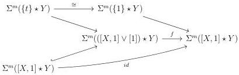

2.4. GLOBULAR EQUIVALENCES

Lemma 2.4.4.5. Let m be an integer and X and Y be two  \( (0,\omega) \) -categories admitting a loop free and atomic basis. We denote by 0, 1 and t the three points of  \( \Sigma X \vee [1] \) . Let

\[
f: \Sigma^ {m} ([ X, 1 ] \star Y) \to \Sigma^ {m} (([ X, 1 ] \vee [ 1 ]) \star Y)
\]

be a morphism fitting in the following diagram:

Then \( f \) is the morphism induced by the retraction \( [X,1] \vee [1] \to [X,1] \).

Proof. The proof is an easy computation using Steiner theory, similar to the one done in lemma 2.4.4.4, and left to the reader. \(\square\)

##### 2.4.4.6. Let C be the subcategory of marked simplicial sets whose

- objects are the marked simplicial sets \( X \) such that \( \mathrm{R}(X) \) has no non-trivial automorphisms, and such that there exists a (necessary unique) isomorphism

\[
\phi_ {X}: \mathrm{R} (i X) \to \mathrm{R} (X),
\]

- morphisms are the maps \( f: X \to Y \) making the induced diagram

\[
\begin{array}{c} \operatorname{R} (i (X)) \xrightarrow {\phi_ {X}} \operatorname{R} (X) \\ \operatorname{R} (i (f)) \Big \downarrow \qquad \qquad \qquad \qquad \qquad \qquad \qquad \qquad \qquad \qquad \qquad \qquad \qquad \qquad \qquad \qquad \qquad \qquad \qquad \qquad \qquad \qquad \qquad \qquad \qquad \qquad \qquad \qquad \qquad \qquad \qquad \qquad \qquad \qquad \\ \operatorname{R} (i (Y)) \xrightarrow {\phi_ {Y}} \operatorname{R} (Y) \end{array}
\]

commutative.

Remark 2.4.4.7. As R sends acyclic cofibrations to isomorphisms, C is stable by zigzags of acyclic cofibrations. Moreover, as R and i preserve colimits, for any diagram  \( F: I \to C \)  such that the  \( (0, \omega) \) -category  \( \mathrm{R}(\mathrm{colim}_{I} F) \)  has no non-trivial automorphisms,  \( colim_{I} F \)  is in C. Eventually, the colimit of any natural transformation between two such diagrams is in C.

Lemma 2.4.4.8. Let \((k,n)\) be a couple of integers such that \(k\leq n\). We set the convention \([-1]:= \emptyset\). For any integer \(m\), the following assertion holds:

105